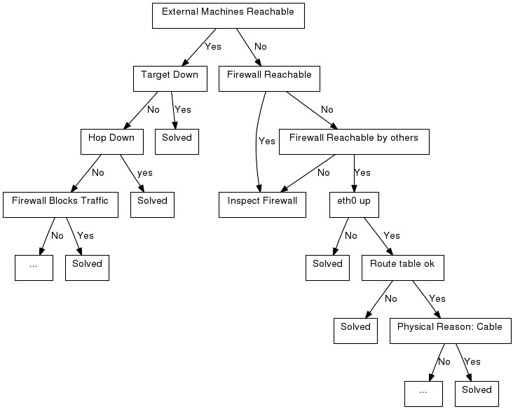

##  Troubleshooting network issues (205.3)

Candidates should be able to identify and correct common network setup
issues, to include knowledge of locations for basic configuration files
and commands.

###   Key Knowledge Areas

-   Location and content of access restriction files

-   Utilities to configure and manipulate ethernet network interfaces

-   Utilities to manage routing tables

-   Utilities to list network states

-   Utilities to gain information about the network configuration

-   Methods of information about the recognised and used hardware
    devices

-   System initialisation files and their contents (Systemd and SysV
    init process)

-   Awareness of NetworkManager and its impact on network configuration

###   Terms and Utilities

-   `ip`

-   `ifconfig`

-   `route`

-   `ss`

-   `netstat`

-   `/etc/network/`, `/etc/sysconfig/network-scripts`

-   `ping`, `ping6`

-   `traceroute`, `traceroute6`

-   `mtr`

-   `hostname`

-   System log files such as `/var/log/syslog` & `/var/log/messages`

-   `dmesg`

-   `/etc/resolv.conf`

-   `/etc/hosts`

-   `/etc/hostname`, `/etc/HOSTNAME`

-   `/etc/hosts.allow`, `/etc/hosts.deny`

###   Introduction to network troubleshooting

It would be great if you would be able to open up a book and find
an index there of all possible network problems
and their solutions. But in practice that is impossible. There are way
too many scenarios to describe and new technologies are surfacing
constantly, creating new options - and new problems. However, almost
every problem can be solved by applying knowledge and logic. In the case
of network troubleshooting, this means mostly that you should determine
how traffic *should* flow from source to destination and back, and
checking step by step if you can see the traffic passing by using the
tools described earlier. Also, make sure to check traffic in both
directions if possible, as many network problems stem from the fact that
traffic from source to destination may not be following the same path as
traffic the other way around.

Key files, terms and utilities have already been described in
[???](#lpic2.205) and other chapters. In this chapter we focus on the
problem solving process and introduce a number of additional techniques,
utilities and key files.

####  An example situation

You are browsing the Internet on a PC. It is connected to the Internet
via a local area network and a firewall. Suddenly, you can not access
your favourite webpage anymore. It could be the network, the firewall,
the ISP, or even the browser.. what is a reasonable approach to find the
problem and solve it?

**Note**
The focus of this section is on troubleshooting networks. Hence we will
focus on network components. In a real situation there are many more
components involved, for example the browser, operating system, local
firewall setups etc. on which we will touch only briefly.

The first step is to assemble a list of all network components involved.
The lenght of the list varies, depending on the complexity of the
configuration and your personal knowledge. 

A simple list would at least
contain this: troubleshooting components involved troubleshooting first
step

-   The PC itself. It has a network interface that is connected to the
    LAN (eth0 in most situations);

-   The firewall. It has two interfaces: its eth0 interface which is
    connected to the LAN and the eth1 interface which is connected to
    the router that in turn is connected to the an ISP who provides
    Internet connectivity;

-   The site you are trying to reach, connected to the Internet.

Then think about how everything works together. You enter the URL in the
browser. Your machine uses DNS to find out what the IP address is of the
web site you are trying to reach etc.

Packets travel through your eth0 interface over the LAN to the eth0
interface of the firewall and through the eth1 interface of the firewall
to the ISP and from the ISP in some way to the web server.

Now that you know how the different components interact, you can take
steps to determine the source of the malfunction.

The graphic below gives an example of step-by-step troubleshooting.

S

-   The cause of the problem has been determined and can be S(olved).

1

-   Can we reach other machines on the internet ? Try another URL or try
    pinging another machine on the internet. Be troubleshooting ping
    troubleshooting ICMP careful to jump to conclusions if your `ping`
    reports no connectivity - your firewall could be blocking ICMP
    echo-requests and replies.

2

-   Is the machine we are trying to reach, the target, down? This is a
    feasible theory if for example other sites can be reached. Try
    reaching the machine via another network, contact a friend and let
    him try to reach the machine, call the person responsible for the
    machine etc.

3

-   Can we reach the firewall? Try pinging the firewall, login to it
    etc.

4

-   Is there a router on the route (a "hop") down ? troubleshooting HOP
    Use `traceroute` to find out what the hops are between you and the
    target host. The route from a machine to LPI's web-server for
    instance can be determined by issuing the command
    `traceroute -I www.lpi.org`: troubleshooting traceroute

            # traceroute -I www.lpi.org
            traceroute to www.lpi.org (209.167.177.93), 30 hops max, 38 byte packets
            1  fertuut.suegroningen (192.168.2.1)  0.555 ms  0.480 ms  0.387 ms
            2  wc-1.r-195-85-156.essentkabel.com (195.85.156.1)  30.910 ms  26.352 ms  19.406 ms
            3  HgvL-WebConHgv.castel.nl (195.85.153.145)  19.296 ms  28.656 ms  29.204 ms
            4  S-AMS-IxHgv.castel.nl (195.85.155.2)  172.813 ms  199.017 ms  95.894 ms
            5  f04-08.ams-icr-03.carrier1.net (212.4.194.13)  118.879 ms  84.262 ms  130.855 ms
            6  g02-00.amd-bbr-01.carrier1.net (212.4.211.197)  30.790 ms  45.073 ms  28.631 ms
            7  p08-00.lon-bbr-02.carrier1.net (212.4.193.165)  178.978 ms  211.696 ms  301.321 ms
            8  p13-02.nyc-bbr-01.carrier1.net (212.4.200.89)  189.606 ms  413.708 ms  194.794 ms
            9  g01-00.nyc-pni-02.carrier1.net (212.4.193.198)  134.624 ms  182.647 ms  411.876 ms
            10  500.POS2-1.GW14.NYC4.ALTER.NET (157.130.94.249)  199.503 ms  139.083 ms  158.804 ms
            11  578.ATM3-0.XR2.NYC4.ALTER.NET (152.63.26.242)  122.309 ms  191.783 ms  297.066 ms
            12  188.at-1-0-0.XR2.NYC8.ALTER.NET (152.63.18.90)  212.805 ms  193.841 ms  94.278 ms
            13  0.so-2-2-0.XL2.NYC8.ALTER.NET (152.63.19.33)  131.535 ms  131.768 ms  152.717 ms
            14  0.so-2-0-0.TL2.NYC8.ALTER.NET (152.63.0.185)  198.645 ms  136.199 ms  274.059 ms
            15  0.so-3-0-0.TL2.TOR2.ALTER.NET (152.63.2.86)  232.886 ms  188.511 ms  166.256 ms
            16  POS1-0.XR2.TOR2.ALTER.NET (152.63.2.78)  153.015 ms  157.076 ms  150.759 ms
            17  POS7-0.GW4.TOR2.ALTER.NET (152.63.131.141)  143.956 ms  146.313 ms  141.405 ms
            18  akainn-gw.customer.alter.net (209.167.167.118)  384.687 ms  310.406 ms  302.744 ms
            19  new.lpi.org (209.167.177.93)  348.981 ms  356.486 ms  328.069 ms
                                

5

-   Can other machines in the network reach the firewall? Use ping, or
    login to the firewall from that machine or try viewing a web page on
    the internet from that machine.

6

-   Does the firewall block the traffic to that particular machine?
    troubleshooting blocking traffic troubleshooting firewall Maybe
    someone blocked traffic to and/or from that site.

7

-   Inspect the firewall. If the problem seems to be on the firewall,
    test the interfaces on the firewall, inspect the firewalling rules,
    check the cabling etc.

8

-   ifconfig Is our eth0 interface up? This can be tested by issuing the
    command `ifconfig eth0`.

9

-   route Are your route definitions as they should be? Think of things
    like default gateway. The route table can be viewed troubleshooting
    routing by issuing the command `route -n`.

10

-   Is there a physical reason for the problem? Check if the the problem
    is in the cabling. This could be a troubleshooting physical problem
    defective cable or a badly shielded one. Putting power supply
    cabling and data cabling through the same tube without metal
    shielding between the two of them can cause unpredictable, hard to
    reproduce errors in the data transmission.

####  Name resolution problems

There are even more options why the connection fails:

Name resolution is the translation of a hostname into an IP address. If
a user tries to connect to a machine based on the hostname of that
machine and the hostname resolution doesn't function properly then no
connection will be established at all.

The file `/etc/resolv.conf` contains the IP addresses of the
nameservers. The nameservers are the servers that do the name resolution
for a external network. For small (local) networks a local lookup table
can be made by using the `/etc/hosts` file. This file contains a list of
aliases or FQDN (fully qualified domain name) (or both) per IP address.

You can check name resolution with the commands `dig` (dig is
an acronym for Domain Information Groper) or `host`. Both of
these commands return the IP address associated with the hostname.

        $ host ns12.zoneedit.com
        ns12.zoneedit.com has address 209.62.64.46
                

        $ dig zonetransfer.me

        ; <<> DiG 9.8.3-P1 <<>> zonetransfer.me
        ;; global options: +cmd
        ;; Got answer:
        ;; ->>HEADER<<- opcode: QUERY, status: NOERROR, id: 6133
        ;; flags: qr rd ra; QUERY: 1, ANSWER: 1, AUTHORITY: 2, ADDITIONAL: 1

        ;; QUESTION SECTION:
        ;zonetransfer.me.       IN  A

        ;; ANSWER SECTION:
        zonetransfer.me.    7142    IN  A   217.147.180.162

        ;; AUTHORITY SECTION:
        zonetransfer.me.    7142    IN  NS  ns12.zoneedit.com.
        zonetransfer.me.    7142    IN  NS  ns16.zoneedit.com.

        ;; ADDITIONAL SECTION:
        ns12.zoneedit.com.  7116    IN  A   209.62.64.46

        ;; Query time: 1 msec
        ;; SERVER: 213.154.248.156#53(213.154.248.156)
        ;; WHEN: Thu Jul  4 10:59:55 2013
        ;; MSG SIZE  rcvd: 115
                

`dig` is the swiss army knife of name resolving and has a lot of
options. It provides elaborate output. The `host` command offers a fast
and convenient way to seek out an IP address for a host known by its
name.

The hostname of a machine itself is stored in a file called
`/etc/hostname` or `/etc/HOSTNAME` for Debian based systems. On RedHat
systems the name is stored in the file `/etc/sysconfig/network`. For all
systems the hostname can be found with the command `/bin/hostname`. When
given no argument, this command gives replies with the hostname of the
machine. In case an argument is given along with the command, the
hostname of the machine will be changed.

####  Incorrect initialization of the system

Another possible cause of network
problems can be the incorrect initialization of the system. To find any
initialization errors check out the file `/var/log/messages` or read the
kernel ring buffer by using the `/bin/dmesg` command.

####  Security settings

Security settings can also be a source of connection problems. The
server may have blocked access from or allow access from certain clients
using the `/etc/host.deny` resp. `/etc/host.allow`

####  Network configuration

Perhaps network settings were copied over from another
site and not adapted to the local situation?  You can check these
settings in the files in the directory `/etc/sysconfig/network-scripts`
for RedHat-based systems or in the file `/etc/network` for Debian-based
systems.

####  NetworkManager

NetworkManager is a GUI based tool to manage your networkconnections.
NetworkManager is a also a service that is able to report network
changes. The purpose of NetworkManager is to simplify the use of
configuring your network within Linux.

Typically the user settings will be stored in:
`/home/$user/.gconf/system/networking/connections` The system settings
are stored in:
`/etc/Networkmanager/ /etc/NetworkManager/system-connections` Be aware
of the fact that NetworkManager will overwrite any configuration changes
made to networksettings.

There is also an option to configure your NetworManager on the
commandline. It is called nmcli and you can find it at `/usr/bin/nmcli`.
