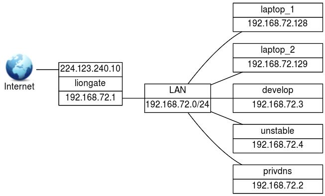

##  Securing a DNS Server (207.3)

Candidates should be able to configure a DNS server to run as a non-root
user and run in a chroot jail. This objective includes secure exchange
of data between DNS servers.

###   Key Knowledge Areas

-   BIND 9 configuration files

-   Configuring BIND to run in a chroot jail

-   Split configuration of BIND using the forwarders statement

-   Configuring and using transaction signatures (TSIG)

-   Awareness of DNSSEC and basic tools

-   Awareness of DANE and related records

###   Terms and Utilities

-   `/etc/named.conf`

-   `/etc/passwd`

-   DNSSEC

-   `dnssec-keygen`

-   `dnssec-signzone`

##  DNS Security Strategies

There are several strategies possible to make DNS more secure.

When a security bug is discovered in the BIND nameserver, it will often
be fixed within a few hours. This results in a new BIND release. Hence,
older versions of BIND may have security related bugs. BIND users should
frequently visit [the BIND source site
(http://www.isc.org/downloads/bind/)](http://www.isc.org/downloads/bind/)
to check for new updates. You may consider subscribing to a security
announcement list; most Linux distributions have one. For instance, the
Debian `debian-security-announce`. To subscribe to that list visit
<https://lists.debian.org>.

####  Making information harder to get

Like all other programs, the BIND nameserver has features and security
holes that can be misused. Criminal hackers (crackers) are well aware of
this and keep track of versions and their security related issues. It is
wise not to advertise your vulnerabilities so you may want to disable
version number reporting in BIND.

Also, bulk nameserver data can be used to disclose details about your
infrastructure. Hence restrictions can be installed to prevent a user
from obtaining a large amount of nameserver data or at least to get it
in a short timeframe. Another reason to do so is that nameservers are
built to answer a large number of short queries in a short timeframe.
Having to serve large blobs of data unexpectedly might disrupt services.

It is important to remember that hiding information is *security through
obscurity*. Doing so, the easy way to get information has been blocked
but there may be other ways to get it. *Security through obscurity*
makes it harder, but not impossible to get the information. It does
however introduce a longer timeframe in which you may be able to detect
break-in attempts and act accordingly, for example by blocking the
requestors IP address in your firewalls.

####  Hiding the version number

The command

        dig @target chaos version.bind txt
                    

will show the version of the BIND nameserver on host *target*.

The BIND version can be hidden by entering a `version` statement inside
the `options` statement in `named.conf`. In the following example, the
version will be set to the string `hidden`.

        options {
            // ...

            // hide bind version
            version "hidden";
        };        
                    

The CERT article ([???](#nijssen99)) shows a way to limit access to the
`bind` zone. This an alternative to replacing the BIND version.

####  Limiting access

There are several ways to limit access to nameserver data. First, an
*access control list* must be defined. This is done with the `acl`
statement.

        acl "trusted" {
            localhost;
            192.168.1.0/24;
        };
                    

This `acl` defines an *access control list* with label `trusted`. ACL
labels are used to simplify administration: you only need to update your
ACLs in one place, after that each reference to a label will
automatically point to the updated data.

A nameserver supports queries by resolvers and zone transfers by other
nameservers.

#### normal queries

-   Normal queries occur when a resolver needs data only on a very
    limited subset of the data. For example it wants to know which IP
    address is associated with a hostname. The `allow-query` statement
    controls from which hosts these queries are accepted.

#### zone transfers

-   The internet name space is built on the idea of a hierarchy of
    domains. To find the IP address of a host, you need its fully
    qualified domain name (*FQDN*). It consists of a series of
    subdomains separated by dots, for example: `www.example.com`. The
    first section is the hostname, i.e. "www". Next is the "example"
    domain, which in turn is a subdivision of the "com" domain. Data on
    a single domain is called a "zone". Slave (backup) nameservers must
    be allowed to get the information from a master of the same zone. It
    is important to restrict these "zone transfers" to the servers that
    need the data only - no more.

    Zone transfers are controlled by the `allow-transfer` statement.
    This statement may also be specified in the `zone` statement,
    thereby overriding the global `options allow-transfer` statement.
    Traditionally zone transfers can be initiated by anybody.

The `allow-query` statement can be used inside a `zone` statement or an
`options` statement as well. It can contain either an acl label (like
`trusted`), `none`, or one or more IP addresses or IP ranges. Use labels
whenever you can: keeping track of permissions is much easier that way
and it makes you less vulnerable to accidental oversights that may cause
security holes.

####  Limiting zone transfers

Both `dig` and `host` can initiate a *zone transfer*. By default, both
master and slave servers are allowed to send all zone information. An
example using the `dig` command:

        $ dig axfr @ns12.zoneedit.com zonetransfer.me

        ; <<> DiG 9.8.3-P1 <<>> axfr @ns12.zoneedit.com zonetransfer.me
        ; (1 server found)
        ;; global options: +cmd
        zonetransfer.me.    7200    IN  SOA ns16.zoneedit.com. soacontact.zoneedit.com. \
            2013064418 2400 360 1209600 300
        zonetransfer.me.    7200    IN  NS  ns16.zoneedit.com.
        zonetransfer.me.    7200    IN  NS  ns12.zoneedit.com.
        zonetransfer.me.    7200    IN  A   217.147.180.162
        zonetransfer.me.    7200    IN  MX  0 ASPMX.L.GOOGLE.COM.
        zonetransfer.me.    7200    IN  MX  10 ALT1.ASPMX.L.GOOGLE.COM.
        zonetransfer.me.    7200    IN  MX  10 ALT2.ASPMX.L.GOOGLE.COM.
        zonetransfer.me.    7200    IN  MX  20 ASPMX2.GOOGLEMAIL.COM.
        zonetransfer.me.    7200    IN  MX  20 ASPMX3.GOOGLEMAIL.COM.
        zonetransfer.me.    7200    IN  MX  20 ASPMX4.GOOGLEMAIL.COM.
        zonetransfer.me.    7200    IN  MX  20 ASPMX5.GOOGLEMAIL.COM.
        zonetransfer.me.    301 IN  TXT "Remember to call or email Pippa on +44 123 4567890 \
            or pippa@zonetransfer.me when making DNS changes"
        zonetransfer.me.    301 IN  TXT "google-site-verification=tyP28J7JAUHA9fw2sHXMgcCC0I6XBmmoVi04VlMewxA"
        testing.zonetransfer.me. 301    IN  CNAME   www.zonetransfer.me.
        164.180.147.217.in-addr.arpa.zonetransfer.me. 7200 IN PTR www.zonetransfer.me.
        ipv6actnow.org.zonetransfer.me. 7200 IN AAAA    2001:67c:2e8:11::c100:1332
        asfdbauthdns.zonetransfer.me. 7900 IN   AFSDB   1 asfdbbox.zonetransfer.me.
        office.zonetransfer.me. 7200    IN  A   4.23.39.254
        owa.zonetransfer.me.    7200    IN  A   207.46.197.32
        info.zonetransfer.me.   7200    IN  TXT "ZoneTransfer.me service provided by Robin \
            Wood - robin@digininja.org. See www.digininja.org/projects/zonetransferme.php for more information."
        asfdbbox.zonetransfer.me. 7200  IN  A   127.0.0.1
        canberra_office.zonetransfer.me. 7200 IN A  202.14.81.230
        asfdbvolume.zonetransfer.me. 7800 IN    AFSDB   1 asfdbbox.zonetransfer.me.
        email.zonetransfer.me.  2222    IN  NAPTR   1 1 "" "E2U+email" "" email.zoneedit.com.zonetransfer.me.
        dzc.zonetransfer.me.    7200    IN  TXT "AbCdEfG"
        dr.zonetransfer.me. 300 IN  LOC 53 20 56.558 N 1 38 33.526 W 0.00m 1m 10000m 10m
        rp.zonetransfer.me. 321 IN  RP  robin.zonetransfer.me.zonetransfer.me. robinwood.zonetransfer.me.
        sip.zonetransfer.me.    3333    IN  NAPTR   2 3 "au" "E2U+sip" "!^.*$!sip:customer-service@zonetransfer.me!".
        alltcpportsopen.firewall.test.zonetransfer.me. 301 IN A 127.0.0.1
        www.zonetransfer.me.    7200    IN  A   217.147.180.162
        staging.zonetransfer.me. 7200   IN  CNAME   www.sydneyoperahouse.com.
        deadbeef.zonetransfer.me. 7201  IN  AAAA    dead:beaf::
        robinwood.zonetransfer.me. 302  IN  TXT "Robin Wood"
        vpn.zonetransfer.me.    4000    IN  A   174.36.59.154
        _sip._tcp.zonetransfer.me. 14000 IN SRV 0 0 5060 www.zonetransfer.me.
        dc_office.zonetransfer.me. 7200 IN  A   143.228.181.132
        zonetransfer.me.    7200    IN  SOA ns16.zoneedit.com. soacontact.zoneedit.com. \
            2013064418 2400 360 1209600 300
        ;; Query time: 334 msec
        ;; SERVER: 209.62.64.46#53(209.62.64.46)
        ;; WHEN: Fri Jun 28 12:01:16 2013
        ;; XFR size: 37 records (messages 37, bytes 2673)
                        

The previous example shows the complete information about
`zonetransfer.me`. The command `host -l` does the same but formats its
output differently:

        $ host -l zonetransfer.me ns16.zoneedit.com
        Using domain server:
        Name: ns16.zoneedit.com
        Address: 69.64.68.41#53
        Aliases: 

        zonetransfer.me nameserver ns16.zoneedit.com.
        zonetransfer.me nameserver ns12.zoneedit.com.
        zonetransfer.me has address 217.147.180.162
        164.180.147.217.in-addr.arpa.zonetransfer.me domain name pointer www.zonetransfer.me.
        ipv6actnow.org.zonetransfer.me has IPv6 address 2001:67c:2e8:11::c100:1332
        office.zonetransfer.me has address 4.23.39.254
        owa.zonetransfer.me has address 207.46.197.32
        asfdbbox.zonetransfer.me has address 127.0.0.1
        canberra_office.zonetransfer.me has address 202.14.81.230
        alltcpportsopen.firewall.test.zonetransfer.me has address 127.0.0.1
        www.zonetransfer.me has address 217.147.180.162
        deadbeef.zonetransfer.me has IPv6 address dead:beaf::
        vpn.zonetransfer.me has address 174.36.59.154
        dc_office.zonetransfer.me has address 143.228.181.132
                        

Only validated slave nameservers should be allowed to issue a *zone
transfer* request. This can be done by making adjustments to the
configuration files (`named.conf`) of both the master and all slaves of
a particular zone. For example:

**On master nameservers.**

On the master nameserver you should use the `allow-transfer` statement
to limit zone transfers to a list of known slave servers.

        acl "my_slave_servers" {
            224.123.240.3;  // cat.example.org
        };

        // ...

        zone "example.org" IN {
            type master;
            // ....

            allow-transfer {
                my_slave_servers;
            };
        };
                            

Now only the slaves (only the host `cat` in the example) can request a
*zone transfer* from this master nameserver.

**On slave nameservers.**

On a *slave* nameserver you should never allow any zone transfers. This
can be achieved by setting the `allow-transfer` clause to 'none':

        zone "example.org" IN {
            type slave;
            // ....

            allow-transfer {
                none;
            };
        };
                            

**Note**
*IMPORTANT:*Don't forget to protect the *reverse zone* as well!

####  Limiting queries

Though strictly spoken any client should be allowed to query a
nameserver, in practice you may want to limit queries to a range of
hosts, for example the hosts in your own networks. This can be done as
follows:

        acl "myhosts" {
            224.123.240.0/24;
        };

        // ...

        zone "example.org" IN {
            // ...

            allow-queries {
                myhosts;
            };
        };
                        

This limits queries to hosts with an IP address that starts with
`224.123.240`.

####  Controlling requests

There are more security controls that can be used.

*Spoofing* is when a malicious nameserver answers a client request with
false data. As nameserver data is extensively cached for performance
reasons, cached data can get infected with the falsified data.
*Spoofing* is quite difficult to achieve, but it is wise to take
precautions against it. Many older spoofing methods have already been
eliminated by patches in the software but BIND can be configured to
further enhance spoofing protection.

####  Limiting effects of an intrusion

Even when you are prepared to implement DNS fixes as soon as they
appear, it may be too late - even if by only a couple of hours: your
system could be compromised anyway. Therefore it is advisable to take
precautions to minimize the impact.

###   Running BIND with less privileges

In some distributions, BIND runs as `root`. If BIND is compromised, the
attacker might have root access. This can be prevented by running BIND
under a non-privileged user and group.

It might be tempting to employ the user `nobody` and group `nogroup`.
But since many services already do this another security issue arises:
these services may be able to communicate in one way or another.

Best practice is to create a special user, e.g. `named`, and a
corresponding group (which could also be called `named`), and run the
nameserver under this user/group combination.

Use the `-u` and `-g` options to run `named` as `named`/`named`:

        named -u named -g named
                    

On a Debian system the start line in `/etc/init.d/bind` would be:

        start-stop-daemon ... --exec /usr/sbin/named -- -u named -g named
                    

(For clarity other options were replaced by dots). The extra `--` tells
the `start-stop-daemon` where its options end, all other options will be
passed on to the `named` program.

On a Red Hat (or compatible) system, the startup file can be found in
`/etc/rc.d/init.d/named`. On RHEL systems the service is already
configured to run under the user 'named'. You can set additional
options in `/etc/sysconfig/named`, for example you can add `-u named`
there. To start the service on Red Hat (compatible) systems, use the
`service` command:

        # service named start
        Generating /etc/rndc.key:                                  [  OK  ]
        Starting named:                                            [  OK  ]
                    

To make `named` start up in the proper runlevels on Red Hat (compatible)
systems run `chkconfig named on`.

**Note**
Make sure the nameserver has write access in the directory specified by
the `directory` option in `named.conf`.

####  Running BIND in a *chroot jail*

Another way to prevent damage from a compromised name-server process is
to put the process in a *chroot jail*. On startup the process will set a
directory (e.g. `/var/cache/bind`) as its root directory. Since no
process is ever capable of accessing anything above its set root, this
prevents the named process access to anything outside `/var/cache/bind`.

#### Preparing a chroot jail

All files that BIND needs must be copied to the new root directory. Full
details can be found here: [???](#chrootbind9).

In short:

-   You will need to copy the `/etc`, `/dev`, `/lib`, `/sbin` or
    `/usr/sbin`, and `/var/run` directories to the chroot.

-   You'll probably need the `/dev/null` device under the new root. The
    next command will create it:

            mknod -m 666 /var/cache/bind/dev/null c 1 3
                                        

-   You will need a `passwd` and a `group` file in the new `/etc`:

            cd /var/cache/bind/etc
            cp -p /etc/{passwd,group} .
                                        

    This copies the literal passwd and group files. An alternative is to
    create special `passwd` and `group` files, as will be shown in
    [Combining special user and chroot](#DNSchrootAndUser).

    You may also need to copy `ld.so.cache` and `localtime`:

            cd /var/cache/bind/etc
            cp /etc/ld.so.cache .
            cp /etc/localtime .
                                        

-   The BIND configuration should also be placed under the new root, as
    `named` might need it when you reload the server. Given that your
    new root is set to `/var/cache/bind` you should copy the file over
    to `/var/cache/bind/etc/bind`.

    Note that all directories in the new `named.conf` - as specified
    with the `directory` option - are relative to the new root
    directory, so you do not need (or should) include the prefix
    `/var/cache/bind` there.

-   The new `lib` directory must contain at least all the shared
    libraries used by BIND. You can list these with the `ldd` command.
    For instance, suppose the command:

            ldd /usr/sbin/named
                                        

    yields

            libc.so.6 => /lib/libc.so.6 (0x40015000)
            /lib/ld-linux.so.2 => /lib/ld-linux.so.2 (0x40000000)
                                        

    In the (real) `/lib` directory, `libc.so.6` is a symlink to
    `libc-2.1.3.so` and `ld-linux.so.2` is a symlink to `ld-2.1.3.so`.
    Both the symlinks and the files they point to must be copied to the
    `lib` directory under the new root:

            cd /var/cache/bind/lib
            cp -pd /lib/{libc.so.6,libc-2.1.3.so,ld-linux.so.2,ld-2.1.3.so} .
                                        

-   Both the `named` and the `named-xfer` programs must be present under
    the new root. The `rndc` program might be useful too. For example:

            cp -p /usr/sbin/named{,-xfer} /var/cache/bind/usr/sbin
            cp -p /usr/sbin/rndc /var/cache/bind/usr/sbin
                                        

#### Running BIND chrooted

To start the BIND nameserver in a *chroot jail*, simply add the `-t`
option followed by a directory name, either on the command line, in the
startup script, or in the `sysconfig` file.

**Note**
The `-t` option actually runs the `chroot` command to start the
nameserver. Read the manual pages on the `chroot` command to learn more.

In some systems you may need to add the option to the startup file. For
example:

        start-stop-daemon ... --exec /usr/sbin/named -- -t /var/cache/bind
                        

or

        daemon ... /sbin/named -t /var/cache/bind
                        

The BIND nameserver switches to the chroot immediately after command
line argument parsing, so before configuration files are read. All paths
in the configuration file should be relative to the new root.

#### Configuration for a chrooted BIND

As a consequence of a chrooted jail, all configuration files (e.g. zone
files and `named.conf`) must be present in a directory (e.g.,
`/etc/bind`) under the chroot directory.

Logging to syslog will not work either as the chrooted process has no
access to the Unix socket located outside the jail (no access to
`/dev/log`). There are various workarounds but the simplest is to use an
alternative logfile inside the chrooted environment. See this fragment
of a `named.conf` file you could use:

        logging {
            channel some_log { 
                file "bind.log" versions 3;
                severity info;
            };

            category default { some_log; };

            // ...
        };
                        

This will write logging information to the file
`/var/cache/bind/var/cache/bind/bind.log`.

Zone files, if any, should also be put inside the chroot environment.
For instance, if `named.conf` contains a definition of a master zone
like this:

        zone "example.com" IN {
            type master;
            file "/etc/bind/example.com.zone";
        };
                        

Then the `example.com.zone` file needs to be located in
`/var/cache/bind/etc/bind`, again assuming your chroot directory is
`/var/cache/bind`.

####  Combining special user and chroot

More technical security can be obtained by using a combination of a
chrooted environment and running the nameserver under a special
non-privileged user and group. Note that these users will have to be
available in the copies of `/etc/passwd` and `/etc/group` that were
created in the chrooted environment. Finally, set permissions on the
chrooted zone and configuration files to make them read-only for the
named user and group.

**Note**
Inspecting the source for BIND reveals the order of things:

-   parsing of command line options

-   chrooting

-   become a background process and write pid file

-   change to new user and group

The pid file is still written by the `root` user, after that the less
privileged 'named' user will be used.

The `/etc/passwd`, `/etc/shadow`, and `/etc/group` files in the chroot
environment may differ from the ones used by the rest of the system. The
special user and group for the nameserver may not even exist outside the
jail.

###   Securing nameserver connections

Restricting access to trusted hosts can be done using the
`allow-transfer` and `allow-query` statements in `named.conf` and may
help limit risks. Since the restrictions are IP address based, there is
still a residual risk that a villain use spoofing techniques. This could
still lead to the misuse of your system.

*Signing* data could help prevent this. When the server and client use a
shared secret to sign the data between them we can be quite sure that
both parties are whom they say they are.

To further secure nameserver connections a set of protocols called
*DNSSEC* (Domain Name System Security Extensions) can be used as an
extra security layer.

####  A cryptography crash course {#CCC}

To understand how DNSSEC works you need to be aware of the concepts of
message authentication codes, hashes and asymmetrical encryption.

You are probably aware of the concept of symmetrical encryption. Using a
key and some algorithm a cleartext message is scrambled into something
incomprehensible. To restore the message, you need the same key. This
works fine to shield a message from prying eyes, but it is not usable to
prove that a message was sent by a given party. Either party could write
a message, encrypt it with the private key and say it was the other
party that wrote the message. There is no way you can tell if this is
actually true.

The related concept of asymmetrical encryption also allows enciphering
and deciphering of messages. But instead of one shared key there are two
separate but related ones: one is used to encipher a message, the other
to decipher it. After generating such a key pair the owner hands out
only one of these keys to the other party or parties, the *public* key.
The other half of the key pair is kept secret (the *private* key).
Whomever has access to the public key can use it to encrypt a message.
The owner of the corresponding private key will be the only person that
can decipher it. Hence the sender can be sure that he alone can read the
message. Moreover he can send an encrypted message, using the private
key to encipher it. Everyone with access to the public key will be able
decipher it, and can be sure that it really was the owner of the
corresponding private key that sent the message.

Either private, public, or symmetric keys may be used to compute a MAC
(Message Authentication Code). The algorithm to compute a MAC uses two
inputs: the key and the message. The output is a fixed length string of
hexadecimal digits. The MAC is computed using the key (or half of a key
pair) and both the MAC and the message are subsequently sent. The
receiving party will also use the message to calculate the MAC with the
shared key or the other half of the key pair. If both hashes match there
is a very high certainty the message has not been altered and that it
originates from the sender. Note that when you use a MAC the message
itself will *not* be encrypted, it can be read by anybody.

DNSSEC signs its messages with a MAC. It uses a private key that is only
known to DNSSEC. The corresponding public key is published on the
nameservers of the next level zone. It can be obtained by querying the
parent domain nameservers (the 'trust anchor'). So the public key for
example of the `sidn.nl` domain will be available on the 'nl'
nameservers. The public key itself in turn will be signed using a
private key whose public key will be available on the next level above.
So for the domain a.b.c the public keys of "a" can be found on the zone
server for "b". The public keys are signed with the private key whose
public key is published on the nameservers of "c" (You may want to read
that sentence again ;-) ).

Eventually the verification chain ends at the root servers. To obtain
the keys used to sign the top level domains the `dig` could be used but
of course, the query might be also be spoofed. Therefore serious
validating resolvers obtain the keys by other means. For instance by
retrieving them from a signed software package, similarly to the
built-in SSL root certificates in browsers.

####  Using the `dnssec-keygen` command

According to the lpic2 objective you must be able to use BIND 9's
`dnssec-keygen`.

**Note**
The `dnssec-keygen` command is part of the DNSSEC security extension for
DNS (fully described in [???](#Albitz01)).

DNSSEC was not fully implemented in BIND versions older than 9.2.

The 13 authoritive root servers use DNSSEC since May 6th 2010.

The `dnssec-keygen` may be used to generate public/private and symmetric
keys. See [CrashCryptoCourse](#CCC). The key pairs are meant to be used
to authenticate zone data. The symmetric keys are for
Request/Transaction signatures.

The required parameters for generating a key:

a *algorithm* (`-a` option)

-   RSA \| RSAMD5 \| DH \| DSA \| RSASHA1 \| HMAC-MD5

a *key size* (`-b` option)

-   Depends on chosen algorithm: RSAMD5: \[512..4096\], RSASHA1:
    \[512..4096\], DH: \[128..4096\], DSA: \[512..1024\] and a multiple
    of 64, HMAC-MD5: \[1..512\]

a *nametype* (`-n` option)

-   ZONE \| HOST \| ENTITY \| USER \| OTHER

#### Format of the key files

`dnssec-keygen` creates two files: `K`*name*`+
                `*algorithm*`+
                `*footprint*`.private` and `K`*name*`+
                `*algorithm*`+
                `*footprint*`.key`.

As an example, say we typed this command:

        $ dnssec-keygen -a DSA -b 768 -n ZONE example.com.
                    

After completion there will be two files, which have names similar to
`Kexample.com.+003+58649.key` and `Kexample.com.+003+58649.private`.

The private key file `Kkey.example.com.+003+58649.private` will have
contents similar to this:

        Private-key-format: v1.2
        Algorithm: 3 (DSA)
        Prime(p): ww4 ..
        Subprime(q): qHwn .. 
        Base(g): ncWqWFJ ... 
        Private_value(x): YuO ...
        Public_value(y): JKvGZ ...
                    

Note that lines that have been truncated for better readability end in
an ellipsis.

The contents of `Kkey.example.com.+003+58649.key` will be similar to
this:

        example.com. IN DNSKEY 256 3 3 BKh8J+a ...
                    

Please note that generation of a HMAC-MD5 generates two files too, but
both will contain the exact same 'key':

        $ dnssec-keygen -a HMAC-MD5 -b 512 -n HOST peek.a.boo
        Kpeek.a.boo.+157+39506

        $ ls Kpeek.a.boo.+157+39506.*
        Kpeek.a.boo.+157+39506.key  Kpeek.a.boo.+157+39506.private

        $ cat Kpeek.a.boo.+157+39506.key
        peek.a.boo. IN KEY 512 3 157 HUcmGO7VZ ...

        $ cat Kpeek.a.boo.+157+39506.private
        Private-key-format: v1.2
        Algorithm: 157 (HMAC_MD5)
        Key: HUcmGO7VZ ...
                    

####  Using the key

You can refer to a key by adding a `key` statement in `named.conf`, and
copy and paste the key you generated in that section:

        key key.example.com. {
            algorithm "hmac-md5";
            secret "5HUcmGO7VZ ...";
        };
                    

The key can be read (and possibly misused) by anybody who has access
rights to the `named.conf` file. Make sure it can not be read by anybody
but the nameserver user.

You can also put the key statement in a separate file and include that
file using the `include` statement. In this case the same warning
applies with regard to permissions.

To allow a client to use the key to connect to us we need to add a
`server` clause in our configuration. Say we are on a server which has
IP address `224.123.400.2` and want to allow access for a server with IP
address `224.123.400.1` we may use:

        server 224.123.400.1 {
            keys key.example.com.;
        };
                    

On the other server (`224.123.400.1`) we need to do the same for server
`224.123.400.2`: add the `key` statement and copy in the key and allow
the other host to connect to us.

You can now configure the types of access that are allowed when one has
a key. As an example, to limit zone-transfers to hosts that have the
proper keys installed, use:

        zone "example.com" {
            type master;
            file "example.com.zone";
            allow-transfer { key key.example.com.; };
        };
                    

See the `named.conf(5)` manual page for additional use cases.

dnssec-signzone {#dnssecsignzone}

DNSdnssec-keygen DNSdnssec-signzone Similar to the `dnssec-keygen`
command, BIND 9 includes the `dnssec-signzone` utility. As its name
implies `dnssec-signzone` can be used to sign a zone. We already saw how
keys are used to *authorize* servers. Signing a zone helps a client to
verify the *integrity* of the data.

DNS RRSIG When using DNSSEC, so called `RRSIG` records store the actual
digital signatures that were created while signing the resource records
for a domain using a `dnskey`.

The `dnssec-signzone` utility can be used to add RRSIG records to zones.

DNSNSEC `NSEC` records (`Next SECure`) are used to specify a range of
*non-existing domains*. NSEC records were invented to solve a problem:
if you queried a secured nameserver (one that signs the results of a
query) and you would ask for a non-existing name, it would simply return
- nothing. As you can't sign 'nothing' you would never know if the
anwer you got - nothing - really is what you should have gotten. Hence
NSEC records. A NSEC record (Next SECure) states a range of names that
do not exist. As NSEC records can be signed the answer can be trusted
again.

An Example of an NSEC record for the dnssec-tools.org domain:

        adonis.zonetransfer.me.       10800   IN      NSEC   helena.zonetransfer.me.
                        

The record specifies that no DNS records exist between
`adonis.zonetransfer.me.` and `helena.zonetransfer.me.
                `, which would exclude `brutus.zonetransfer.me. 
            ` from being an existing and therefore valid domain.

Use of NSEC records solves one problem, but introduces the next: it
allows easy retrieval of all zone data by simply asking for a random
name. This works because NSEC records assume alphabetical ordering of
domain names. An example: if you would request 'a.example.com' and the
answer would be 'do not have it, but the next valid record is
joe.example.com', you know that joe.example.com exists and nothing
before it does. So, then you might try jof.example.com, as 'f' is the
next letter in the alphabet, etc. A solution to solve this problem is
the NSEC3 record. The NSEC3 record is actually a NSEC record too but it
will not return the next *name*, but *the hash of the next name*. If you
ask for a.example.com you will get a record that says 'not here, and
this is the hash of the next valid domain name'. There are no known
methods - other than brute force - to find a name that matches that
hash. If you already know the next valid domain name, you can calculate
its hash and verify the answer. If you do not, the data will not help
you to find out.

#### DANE

After having set up DNSSEC for a certain domain, it is possible to make
use of DNS Authenticated Named Entities: DANE. In order to understand
the advantage of DANE, we need to look at the problem DANE is trying to
address. And this problem involves Certificate Authorities, or CA's in
short.

The problem with CA-dependant encryption solutions lies in the
implementation. When visiting a SSL/TLS Encrypted website via HTTPS, the
browser software will gladly accept ANY certificate that uses a matching
CN value AND is considered as being issued by a valid Certificate
Authority. The CN value is dependent on DNS, and luckily we just set up
DNSSEC to have some assurence regarding that. But, modern browsers come
with over 1000 *trusted* root certificates. Every certificate being
presented to the browser by a webserver, will be validated using these
root certificates. If the presented certificate can be correlated to one
of the root certificates, the science matches and the browser will not
complain. And that's a problem.

In a perfect world, this system could provide some assurance.
Unfortunately, every chain is only as strong as it's weakest link. Many
known attack vectors exist in regards to integrity and confidentiality
of HTTPS sessions. The Certificate Authorities are in a league of their
own though. Just as every CA needs to be in control of their security
100% of the time, an attacker only needs one moment one CA is not. If an
attacker gets hold of one of the keys used to sign certificates, it is
Game Over\[tm\]. This has happened in the past, and there is no
assurence it will not happen again in the future.

The problem consists of browsers accepting any *valid* certificate for
any domain. And lack of control about exactly which certificates are
valid for exactly what domain. There are a couple of workarounds out
there like *Certificate Transparency* and *Certificate Pinning*. But for
now, these remain to be workarounds for a flawed system. After all, the
problem is not limited to your Desktop. The provided trust in CA-issued
certificates becomes a problem when that CA cannot be trusted anymore.
This has happened.

The infamous "Black Tulip" case describes a breach that has occured at a
Dutch CA called DigiNotar. Attackers gained access to systems and
generated fake certificates for major websites. Except, these
certificates were not recognized as fake since they had been generated
by a *trusted* CA. The *certificate chain* could be backtraced to
DigiNotar and seemed valid. Despite DigiNotar never having received the
order or permission to generate certificates for the affected domains.
After it was discovered that attackers had issued multiple DigiNotar
certificates, the trust in DigiNotar as a CA could not be maintained.
The affected CA root certificate was removed from the list of trusted
certificates by many software vendors. DigiNotar filed for bankcrupcy
within weeks.

If that already sounds bad, consider the total impact of this data
breach. Because certificates issued by DigiNotar were blacklisted as a
result, software depending on valid certificates could no longer
function properly. This had real-world consequences, since DigiNotar
also issued certificates to government and trading related customers.
The tulips could not be shipped and went black, so to say. For this
reason, some large corporations that depend on their online presence for
core business get their certificates from more than one CA. This way, if
one CA gets compromised and all related certificates have to be revoked,
that will not be a Single Point Of Failure to the business. Good for the
business, not good for transparency in regards to certificates.

This is where DANE comes in; While depending on the assurance provided
by DNSSEC, DNS records are provided with *certificate associating*
information. This mitigates the dependency regarding static root
certificates for certain types of SSL/TLS connections. These records
have come to be known as *TLSA* records. As with HTTPS, DANE should be
implemented either correctly or better yet not at all. When implemented
correctly, DANE will provide added integrity regarding the certificates
being used for encryption. By doing so, the confidentiality aspect of
the session gets a boost as well.

The TLSA *Resource Record* syntax is described in RFC 6698 sections 2
and 7. An example of a SHA-256 hashed association of a PKIX CA
Certificate taken from RFC 6698 looks as follows:

        _443._tcp.www.example.com. IN TLSA (
              0 0 1 d2abde240d7cd3ee6b4b28c54df034b9
                    7983a1d16e8a410e4561cb106618e971 )
                

Each TLSA Resource Record (RR) specifies the following fields in order
to create the *certificate association*: *Certificate Usage*,
*Selector*, *Matching Type* and *Certificate Association Data*. The
Certificate Association Data Field in the example above is represented
by the SHA-256 hash string value. The contents of this Data Field are
dependent on the values preceeding from the previous three RR fields.
These three fields are represented by `'0 0 1'` in the example above. We
will explain these fields in reverse order. This makes sense if you look
at the hash value and then read the values from right to left as
`'1 0 0'`.

The value `'1'` in the third field from the example above represents the
*Matching Type* field. This field can have a value between `'0'` and
`'2'`. It specifies whether the *Certification Association Data* field
contents are NOT hashed (value `0`), hashed using SHA-256 (value `1`) or
hashed using SHA-512 (value `2`). In the example above, the contents of
the Certificate Association Data field represent a SHA-256 hash string.

The second field represented by a `'0'` represents the *Selector Field*.
The TLSA Selectors are represented by either a `'0'` or a `'1'`. A field
value of `'0'` indicates that the Certificate Association Data field
contents are based on a full certificate. A value of `'1'` indicates
that the contents of the Certificate Association Data Field are based on
the Public Key of a certificate. In the example above, the Selector
field indicates that the SHA-256 hash string from the Certificate
Association Data field is based on a full certificate.

The first field represented by a '0' in the example above represents
the *Certificate Usage* field. This field may hold a value between '0'
and '3'. A value of `'0'` (PKIX-TA) specifies that the Certificate
Association Data field value is related to a public Certificate
Authority from the X.509 tree. A value of `'1'` (PKIX-EE) specifies that
the Certificate Association Data field value is related to the
certificate on the endpoint you are connecting to, using X.509
validation. A value of `'2'` (DANE-TA) specifies that the Certificate
Association Data field value is related to a private CA from the X.509
tree. And a value of `'3'` (DANE-EE) specifies that the Certificate
Association Data field value is related to the certificate on the
endpoint you are connecting to. In the example above, the Certificate
Usage field indicates that the certificate the SHA-256 string is based
on belongs to a public Certificate Authority from the X.509 tree. Those
are the same Certificate authorities that your browser uses. Field
values of `'0'`, `'1'` or `'2'` still depend on these CA root
certificates. The true benefit of TLSA records gets unleashed when
DNSSEC is properly configured and using a value of `'3'` as a value for
the Certificate Usage Field.

Looking back at the very start of the TLSA Resource Record example
above, the syntax clearly follows the `_port._protocol.subject` syntax.
The TLSA Resource Record always starts with an underscore '\_'. Then
the service port is defined (443 for HTTPS) and a transport protocol is
specified. This can be either tcp, udp, or sctp according to RFC 6698.
When generating TLSA records, it is also possible to specify dccp as a
transport protocol. RFC 6698 does not explicitly mention dccp though.
The subject field usually equals the servername and should match the CN
value of the certificate.

It is not mandatory for the LPIC-2 exam to know all these details by
heart. But, it is good to have an understanding about the different
options and their impact. Just as using a value of `'3'` as the
Certificate Usage can have some security advantages, a value of `'0'` as
the Matching Type field can result in fragmented DNS replies when
complete certificates end up in TLSA Resource Records. The success of
security comes with usability.

To generate your own TLSA records, a page like the following can be used
and should provide some insight in to the used parameters and values:
[www.huque.com/bin/gen\_tlsa](https://www.huque.com/bin/gen_tlsa)

As much as the previously mentioned website is suitable for creating
occasional TLSA records, there are circumstances when custom tooling is
more appropriate. The `hashslinger` command-line tool has been developed
to ease the creation of TLSA records.

When implemented correctly and supported widely, DANE has the potential
to secure certificate based encryption for a variety of services.

####  Internal DNS

If your organization uses TCP/IP on its internal networks NDASH a very
common situation nowadays NDASH they will also need a method to locally
resolve hostnames into IP addresses and vice versa. In smaller
organizations whose infrastructure typically does not change much over
time they might use static files (hostfiles), but given the low
break-even point between the costs of maintaining such an infrastructure
and the costs of installing and maintaining your own DNS most
organizations run an internal DNS system.

In simpler setups, only one nameserver may suffice, though given the low
costs involved nameservers will often be installed in pairs. Resolvers
aware of more than one nameserver will query the other server if the
primary server does not respond. If you have a number of divisions and
various interconnected networks your setup will start resembling the
Internet. But there are important differences.

Suppose your division is located outside the firm's main building. The
workgroup will have its own nameservers. Internally, hosts will be
members of the `exworks` (short for bindexworks *exampleworks*) domain,
that is, directly under the root (`.`) domain. To prevent accidental
routing on the Internet the company chooses the use of one of the
non-routable (private) IP networks: `192.168.72`. This implies we need
to maintain both the domain zone and the reverse lookup zone
`72.168.192.in-addr.arpa`.

We can't use the Internet infrastructure as their root nameservers
don't know anything about the `exworks` and `72.168.192.in-addr.arpa`
zones, nor should they: we chose to use a private network after all. If
we also like to be able to resolve real Internet hostnames and
addresses, we can use what is known as a *split-level* DNS setup.
split-level DNS Two split-level DNS setups will be shown.

#### Limiting negotiations

We can use a feature introduced into BIND in the days of dial-up
connections. BIND behind a dial-up connection can be a nuisance: every
time a DNS wants to communicate with a root nameserver, an automatic
dialer sets up a connection. This is expensive. You can stop BIND from
doing this by putting bindheartbeat-interval

        // prevent dialup access
        heartbeat-interval 0;
        dialup yes; // Actually disables dialup!
                    

inside the `options` statement of the `named.conf` file. It is a bit
counterintuitive to have to put `dialup yes` in a configuration actually
meant to prevent dialups, but that's the way to do it.

This trick can also be used to limit communication from an internal zone
like `exworks`. The `exworks` and `72.168.192.in-addr.arpa` zones are
implemented as conventional master zones as described earlier in this
chapter. The fundamental problem with this is that the real root servers
still don't delegate the `exworks` (and corresponding reverse) domain.

Therefore we should pull the internal zones together with the root
nameserver definition into a separate DNS implementation. This requires
at least two independent nameservers, and they can be set up in two
different ways, as will be described below.

####  Split DNS: stand-alone internal master

The first approach consists of a stand-alone nameserver (that is, bind
stand-alone master master for the internal zones) and another nameserver
on another host that can be used to resolve names from both the outside
world and the internal zones.

The figure below presents the `exworks` domain that is used as an
example. 

The `exworks` network.

The two nameservers in this example will be on different hosts. The
first nameserver runs on `privdns` and will provide internal zone
information. The other nameserver is on `liongate`, which will be a
forwarding nameserver for both the internal zones and the outside world.

The host `privdns` (for *private DNS*) will contain the DNS for both the
`exworks` and `72.168.192.in-addr.arpa` zones. This nameserver will have
the following characteristics:

-   it will be master for the root domain, but no DNS except itself will
    be able to access this information

-   it will be master for the the `exworks` and
    `72.168.192.in-addr.arpa` domains. Only other nameservers inside the
    building will be able to access this information

On the other hand, `liongate` will do the following:

-   do forwarding for the internal zones (this should be done *first*)

-   do forwarding for the outside world

#### Configuring the master on `privdns` {#DNSinternalMaster}

First, prepare a master file for the internal root zone. For example:

        $TTL 25h
        .       IN  SOA privdns.exworks. postmaster.privdns.exworks. (
                    2001121000    ; yyyymmhhee (ee == ser/day start 00)
                         28800
                          3600
                        604800
                         86400 )
                IN  NS privdns.exworks.
        privdns.exworks. IN  A  192.168.72.2

        ; glue records
        exworks.                 IN NS privdns.exworks.
        72.168.192.in-addr.arpa. IN NS privdns.exworks.
                        

Note the glue records that delegate the `exworks` and
`72.168.192.in-addr.arpa` zones as being hosted on nameserver
192.168.72.2.

Next, add a `zone` statement in `named.conf` that points to the master
file for the root zone:

        // ROOT MASTER zone for internal DNS server
        zone "." IN {
            type master;
            file "/etc/bind/internal.root.zone";
            allow-transfer { none; };
            allow-query    { none; };
        };
                        

Using the type `master` tells the DNS that this really is a master
server for the root zone. The root zone should not be known to any other
nameservers, therefore the `allow-transfer` and bind allow-transfer bind
allow-query `allow-query` are set to `none`.

**Note**
The root zone definition type `hint`, as present in a default
caching-only server, should be turned *off* (by not including it in the
`named.conf` file).

Now, prepare zone files for the `exworks` and `72.168.192.in-addr.arpa`
zones, and add the corresponding `zone` entries in the `named.conf`
file. The entry for `exworks` should look like this:

        zone "exworks" IN {
            type master;
            file "/etc/bind/exworks.zone";
            allow-transfer { none; };
            allow-query    { 192.168.72.1; }; // liongate
        };
                        

The nameserver on `liongate` is the one providing names to the other
hosts, so the IP address of `liongate` must be listed in the
`allow-query` field.

The same must be done for the corresponding reverse zone.

Make sure the `options` statement contains

        recursion no;
        fetch-glue no;
                        

These statements tell the nameserver it should not accept queries for
zones other than the ones it knows about.

Hosts in the `exworks` zone should point their `resolv.conf` to
`liongate`. bind resolv.conf That is, the file should contain the line:

        nameserver 192.168.72.1
                        

where `192.168.72.1` is the IP address of `liongate`. On `liongate`
itself, however,

        nameserver 127.0.0.1
                        

ensures that local queries are run over the local loop interface, which
is more efficient than using the outside IP address.

**Note**
The entries in `resolv.conf` on `privdns` should not point to the
nameserver on `privdns` itself. If the host is to be used for purposes
that require name resolving, it is better to point the entries to the
nameserver on `liongate`.

#### Configuring DNS on `liongate`

The functionality of the DNS is twofold: first it should resolve names
of the `exworks` zone (and corresponding reverse zone), secondly, it
should resolve names from the outside world.

With the following `forwarders` statement queries bind forwarders to
this nameserver are being forwarded to one on the listed IP addresses
(remember that `forwarders` is part of the `options` statement):

        forwarders {
            192.168.72.2;   // privdns
            224.121.121.99; // ISP's DNS
        };
                        

The nameservers are tried in the order in which they are listed.
Requests are forwarded to `privdns` first. If that one does not have the
answer, the DNS of the ISP is contacted instead.

Note that the IP address of `privdns` should be mentioned *first*: we
don't want requests for internal names be sent to the ISP.

Alternatively, the nameserver on `liongate` can be configured as `slave`
for the `exworks` domain and corresponding reverse domain. We will
discuss this in the next section.

#### Alternatives

There are two alternatives to this setup. Both require two separate
nameservers.

The first alternative is to use *two* `nameserver` statements in
`resolv.conf`:

        nameserver 192.168.72.2
        nameserver 192.168.72.1
                            

The first IP address points to `privdns`, the second to `liongate`. In
this situation, `privdns` should also accept queries from
`192.168.72.0/24` and the `forwarders` statement on `liongate` should
not contain the `192.168.72.2` (the IP address of `privdns`). The
downside of this is that there is no single nameserver entry-point.

The second alternative is to use a `slave` setup bind slave for the
`exworks` (plus corresponding reverse) domain. This situation is
required when two nameservers are running on the same host. This will be
elaborated below, so it will not be discussed here. For this to work,
the `forwarders` statement on `liongate` should not contain the IP
address of `privdns`.

####  Split DNS: two DNS servers on one machine

We assume the same network again but with one important Split DNS
difference: host `privdns` is *not* available. This implies that the
*internal* nameserver must now run on one of the other hosts, which also
needs access to the outside world.

Both nameservers will run on the same host. At least one of the
nameservers must run chrooted. bind chrooted

#### Two nameservers on one host

The following settings must be made:

-   **The *internal* nameserver.**

    There is a master nameserver that serves the `exworks` and
    corresponding reverse domains. It runs chrooted, under its own
    uid/gid, listening at a special port. It will not do any other
    resolver work. This nameserver will be referred to as the *internal*
    nameserver.

-   **The *visible* nameserver.**

    The other nameserver does not need to run chrooted, but it does have
    its own uid/gid. It serves as a `slave` for the `exworks` and
    `72.168.192.in-addr.arpa` domains. It also forwards other requests
    to the ISP. This nameserver will be referred to as the *visible*
    nameserver, since this is the nameserver that will be visible to
    other hosts.

The `nameserver` line in the `resolv.conf` file for the visible
nameserver points to `127.0.0.1`; other hosts in the `exworks` domain
point their resolver to `192.168.72.1` (the IP address of `liongate`).

####Configuring the internal nameserver

The nameserver is put into a chroot jail with his own user and group
bind jail ID's. The nameserver will chroot to
`/var/cache/bindInternal`. It will run, for example, as user `inamed`
with UID `5301` and as group with the same name and GID `5301`.

This chrooted nameserver should be able to write to some directories. To
allow this, these directories should be owned by the `inamed` UID and
GID. The directories (inside the chroot jail) that need this are
`/var/run` (because it needs to write `named.pid`) and bind named.pid
`/var/cache/bind` (because it needs to write e.g. a logfile).

The configuration directory will be `/var/cache/bindInternal/etc/bind`,
so that references from the `named.conf` file in that directory will be
to `/etc/bind`. Files in that directory include the master file for the
root zone and the zone files for both the `exworks` and
`72.168.192.in-addr.arpa` domains.

Here are the three master zone definitions:

        options {
            directory "/var/cache/bind";
            listen-on port 5353 { 127.0.0.1; };
            recursion no;
            fetch-glue no;
        };

        // NOT SHOWN HERE, described elsewhere:
        // - special chroot logging, see above
        // - zones "localhost", "127.in-addr.arpa", "0.in-addr.arpa" and
        //   "255.in-addr.arpa" as usual

        // ROOT MASTER for internal DNS server
        zone "." IN {
            type master;
            file "/etc/bind/internal.root.zone";
            allow-transfer { none; };
            allow-query    { none; };
        };
        // NO root zone, type hint definition!

        // EXWORKS ZONES
        zone "exworks" IN {
            type master;
            file "/etc/bind/exworks.zone";
            allow-transfer { 127.0.0.1; };
            allow-query    { 127.0.0.1; };
        };

        zone "72.168.192.in-addr.arpa" IN {
            type master;
            file "/etc/bind/exworks.rev";
            allow-transfer { 127.0.0.1; };
            allow-query    { 127.0.0.1; };
        };
                        

The `directory` refers to a location inside the chrooted tree. The
`listen-on` specifies that this nameserver should only listen on port
`5353` on the internal address `127.0.0.1`. The other two, `recursion`
and `fetch-glue`, prevent resolving anything except bind fetch-glue bind
recursion the zones that were defined here.

The root zone should does not allow queries and transfers, as it is
meant for local use only.

The `exworks` and `72.168.192.in-addr.arpa` zone definitions allow zone
transfers and queries originated from the other nameserver (the visible
one). No other transfers and queries are allowed for these zones.

####Configuring the visible nameserver

This section will describe how to configure the *visible* nameserver (if
in doubt read [Two nameservers on one host](#DNSInternalVsVisible)
again). Remember it does not run chrooted, nor does it use an alternate
port. It does run under its own UID/GID though.

The visible nameserver should be able to answer queries about both the
inside and outside worlds.

**Note**
The *visible* nameserver on `liongate` could use forwarding to connect
to the internal nameserver, given the software allows you to specify a
port.

The `named.conf` for the visible nameserver, with common parts omitted,
looks like this:

        // /etc/bind/named.conf
        // bind visible configuration on liongate

        options {
            directory "/var/cache/bindVisible";

            // point to the ISP's nameserver for outside world
            forwarders {
                224.121.121.99; // ISP's DNS
            };
        };

        // NOT SHOWN HERE, described elsewhere:
        // - logging as usual
        // - root zone type hint as usual
        // - zones "localhost", "127.in-addr.arpa", "0.in-addr.arpa" and
        //   "255.in-addr.arpa" as usual

        // point to port 5353 for these zones, be slave for both
        zone "exworks" IN {
            type slave;
            masters port 5353 { 127.0.0.1; };
            file "exworks.slave";
            allow-transfer { none; };
            allow-query    { 127.0.0.1; 192.168.72.0/24; };
        };

        zone "72.168.192.in-addr.arpa" IN {
            type slave;
            masters port 5353 { 127.0.0.1; };
            file "72.168.192.in-addr.arpa.slave";
            allow-transfer { none; };
            allow-query    { 127.0.0.1; 192.168.72.0/24; };
        };
                        

This implements:

-   a nameserver to perform slave resolving for the `exworks` and
    `72.168.192.in-addr.arpa` zones.

-   forwarding, to resolve names from the outside world.

The directory specified by the `directory` statement must be writable by
the running nameserver. I.e. if the nameserver runs as user `vnamed` and
group `vnamed`, the directory `/var/cache/bindVisible` must be owned by
user `vnamed` and group `vnamed`. The slave files `exworks.slave` and
`72.168.192.in-addr.arpa.slave` will be put there.

Let's look at the slave zone definitions. Both refer to a master at
port `5353` on the same host. Both definitions do not allow full zone
transfers. The only zone transfers are from master (at port 5353) to
slave (the configuration for the *master* allows this, see [Configuring
the master on ](#DNSinternalMaster)). Normal queries are allowed for the
localhost (`127.0.0.1`, i.e., internal connections on `liongate`), as
well as all hosts in the `exworks` zone (`192.168.72.`*x*).

On `liongate` the `resolv.conf` file will contain

        nameserver 127.0.0.1
                        

that is, it points to the *visible* nameserver which listens on port
`53`. Other hosts in the `exworks` domain will have

        nameserver 192.168.72.1
                        

(the IP address of `liongate`) in their `resolv.conf`.

**Note**
It is not possible to specify a portnumber in `resolv.conf`. The
specified nameserver(s) will be contacted at port `53`.

#### A problem

A master nameserver will send a *notify* message to a slave nameserver
whenever a zone definition changes. This causes the slave to initiate a
zone transfer. But as both servers listen on the same IP address, the
only thing to distinct them are their port numbers. Alas you can't
specify a port number in a `also-notify` statement, so there is no way
to notify the slave if the master data has changed.

There is a simple solution to this problem: if the master zone changes
and after the internal nameserver has reloaded the zone data, restart
the visible nameserver too.

Linux supports binding more than one IP address to a network interface.
Another approach would be to give both servers a unique local IP
address. This involves other configuration changes, which by now you
should be able to manage. Therefore the exercise on how to do this is
left to the reader.

###   TSIG

TSIG (Transaction SIGnatures) provides a secured communication channel
between nameservers for zone transfers. It is a resource friendly
add-on, available in BIND version 8.2 and higher.

TSIG uses shared keys and one-way hashing to provide authenticity and
integrity. See [CrashCryptoCourse](#CCC) for a short introduction to
these concepts.

####  Configuring TSIG for BIND

We need a HMAC-MD55 key pair, which can be generated using the now
familiar `dnssec-keygen` command:

        # dnssec-keygen -a HMAC-MD5 -b 512 -n HOST rndc-key
        Krndc-key.+157+24876
                    

The utility will generate two output files. Note that the keys in both
files will always be duplicates as we required a HMAC-MD5.

        # ls -l Krndc-key.+157+24876*
        -rw------- 1 root bind 117 Jul  5 05:28 Krndc-key.+157+24876.key
        -rw------- 1 root bind 229 Jul  5 05:28 Krndc-key.+157+24876.private
                    

The contents of the private keyfile might be similar to this:

        # cat Krndc-key.+157+24876.private 
        Private-key-format: v1.3
        Algorithm: 157 (HMAC_MD5)
        Key: XIQDYlGaIbWfyopYHS1vtFrlfJiiIkiEbiNj4kN8Ke+F0hEqA7KVwcJMR/6URez32XBEmKZf2W1GUzjpbI2KJQ==
        Bits: AAA=
        Created: 20130705102726
        Publish: 20130705102726
        Activate: 20130705102726
                    

Create a file to hold the secret you just generated and the IP addresses
of slave nameservers. The name of the file can be freely chosen, in this
example `tsig.key` will be used. The syntax of this file can be learned
from this example:

        key "TRANSFER" {
            algorithm hmac-md5;
            secret "XIQDYlGaIbWfyopYHS1vtFrlfJiiIkiEbiNj4kN8Ke+F0hEqA7KVwcJMR/6URez32XBEmKZf2W1GUzjpbI2KJQ==";
        };

        # nameserver 2 (slave)
        server 10.0.1.2 {
            keys { TRANSFER; };
        };  

        # nameserver 3 (slave)
        server 10.0.1.3 {
            keys { TRANSFER; };
        };
                    

Note: the server option points to the slave nameserver.

Edit the BIND main configuration file `named.conf` and include the file
like this:

        include "/etc/bind/tsig.key";
                    

Now, reload the BIND configuration:

        # rndc reload
        server reload successful
                    

Use `rndc tsig-list` to list the currently active TSIG keys. This
completes the configuration on the master. Next we will need to
configure the slaves.

To setup the slave nameserver, create a similar `tsig.key` file there,
that contains the same secret as used on the master nameserver. However,
now make the `server` option point to the master nameserver:

        key "TRANSFER" {
            algorithm hmac-sha1;
            secret "XIQDYlGaIbWfyopYHS1vtFrlfJiiIkiEbiNj4kN8Ke+F0hEqA7KVwcJMR/6URez32XBEmKZf2W1GUzjpbI2KJQ==";
        };

        # nameserver 1 (master)
        server 10.0.1.1 {
            keys { TRANSFER; };
        };
                    

As before, include the path to the `tsig.key` file to the BIND main
configuration file and reload the configuration. TSIG is now enabled.
