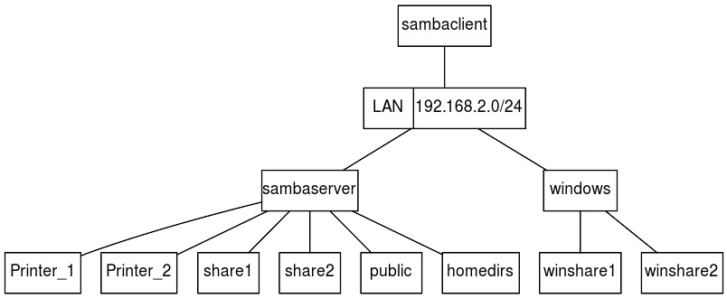
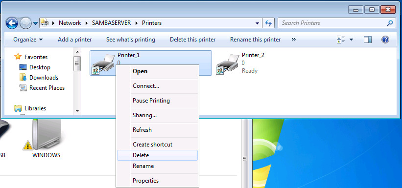

##  SAMBA Server Configuration (209.1)

###   Objective 209.1; Configuring a Samba Server (5 points)

-   Candidates should be able to set up a SAMBA server for various
    clients. This objective includes setting up Samba as a standalone
    and a member server to a Windows Active Directory domain. Both
    setups should be configured to share directories and printers to the
    clients.

###   Key Knowledge Areas

- Samba 4 documentation

- Samba configuration files

- Samba tools and utilities

- Mounting Samba shares on Linux

- Samba daemons

- Mapping Windows usernames to Linux usernames

- User-Level and Share-Level security

###   Terms and Utilities

-   `smbd, nmbd`

-   `smbstatus, testparm, smbpasswd, nmblookup`

-   `smbclient`

-   `samba-tool`

-   `net`

-   `/etc/smb/`

-   `/var/log/samba/`

##  What is Samba?

Samba implements the Server Message Block (SMB) protocol.  This is the protocol
used by Microsoft to implement file and printer sharing. By installing
Samba on a Linux machine, machines running the Windows Operating System
and other platforms for which a SMB client is available can connect to
the Linux machine and thus use files and printers made available by the
Linux machine. Shared resources are also called "shares" or "services".

Samba is available for many platforms including Linux, AIX, HP-UX,
Solaris, FreeBSD, OS/2, AmigaOS. Consult [Samba, Opening Windows To A
Wider World](https://www.samba.org), for further information on platforms
supporting Samba and for downloading a binary or source distribution for
your platform.

###   Installing the Samba components

Depending on your distribution, you can

-   get the sources and compile them yourself

-   install the package using `yum` or `rpm` (Red Hat, SuSE etc.)

-   install the package using `apt`(Debian, Ubuntu)

Samba can be run either from `inetd` or as daemons. When run
via `inetd` you can save some memory and use tcpwrappers for extra
security. When run as daemons, the server is always ready and sessions
are faster. If you wish to use encrypted passwords, you will need to
have a separate `/etc/samba/smbpasswd` file because the layout
sambasmbpasswd differs from `/etc/passwd`. During installation, you can
choose to have `/etc/samba/smbpasswd` generated from your `/etc/passwd`
file. If you choose not to do so, use `smbpasswd` to set individual
passwords for users.

Samba consists of two daemons:

- `nmbd`: the NetBIOS Name Service Daemon which
    handles NetBIOS name lookups and WINS requests. If you've told
    Samba to function as a WINS server, an extra copy of
    `nmbd` will be running. Additionally, if DNS is used to translate
    NetBIOS names, yet another copy of `nmbd` will be running.

-   `smbd`: the Server Message Block Daemon which handles file and
    printer access. For each client connected to the server, an extra
    copy of `smbd` runs.

Samba uses both the UDP and TCP protocols. TCP/139 is used for file and
printer sharing. sambaport 139 UDP is used for the registration and
translation of NetBIOS names, and for browsing the network. UDP/137 is
used for name service requests and sambaport 137 responses. UDP/138 is
used for datagram services to transmit small amounts of data, such as
server announcements.

##  Samba commands

###   Samba core commands

####  smbstatus

Report on current Samba connections:

        $ smbstatus

        Samba version 4.1.12
        PID     Username      Group         Machine                        
        -------------------------------------------------------------------
        23632     nobody        nobody        10.20.24.186 (ipv4:10.20.24.186:49394)

        Service      pid     machine       Connected at
        -------------------------------------------------------
        public       23632   10.20.24.186  Sat Oct 10 10:15:11 2015

        No locked files
                        

####  testparm

Check an smb.conf configuration file for internal correctness.
If `testparm` finds an error in the `smb.conf` file it returns an exit
code of 1 to the calling program, else it returns an exit code of 0.
This allows shell scripts to test the output from `testparm`.

Useful command line options:

-s

-   Print service definitions without prompting for a carriage return

-v

-   List all options; by default only the ones specified in `smb.conf`
    are listed

####  smbpasswd

Change a user's SMB password. By default (when run with no
arguments) `smbpasswd` will attempt to change the current user's SMB
password on the local machine. This is similar to the way the
`passwd`(1) program works. When run by root it can be used to manage
user accounts in the configured password backend. Please note that even
though this utility is called `smbpasswd` it doesn't necessarily write
the changes to the `smbpasswd` file. `smbpasswd` works on the `passdb 
                    backend` configured in `smb.conf`. See also [Account
information databases](#passdb_backend).

Command line usage:

as root:

-   smbpasswd \[options\] \[username\]

as ordinary user:

-   smbpasswd \[options\]

Useful command line options:

-a

-   Add a new user to the password database.

-x

-   Remove user from database

####  nmblookup

Is used to query NetBIOS names and map them to IP addresses in
a network using NetBIOS over TCP/IP queries. The options of this command
allow the name queries to be directed at a particular IP broadcast area
or to a particular machine. All queries are done over UDP.

Useful command line options:

-M

-   Search master browser.

-R

-   Recursion. When using nmblookup to directly query a WIINS server
    with the UNICAST command line option recursion is needed to have the
    WINS server respond to queries not related to its own netbios name
    or IP address. Without recursion set the WINS server will only
    respond with its own netbios name.

-U \<unicast address\>

-   Send the query to the given UNICAST address (of a WINS server)
    instead of broadcasting the query. Example: "nmblookup -R -U
    10.10.10.2 clientname"

####  smbclient

Is a client that can connect to an SMB/CIFS server. It offers
an interface similar to that of the ftp program (see ftp(1)). Operations
include actions like getting files from the server to the local machine,
putting files from the local machine to the server, retrieving directory
information from the server and so on.

Useful command line options:

-L \<netbios name/IP\>

-   List services available on the server responding to the given
    netbios name.

-I \<IP address\>

-   Connect to given IP address directly instead of querying the network
    for the IP address of the given netbios name.

-c \<command\>

-   Run given SMB command on the server. One implementation is printing
    with smbclient.

-U

-   Connect as the given user.

####  samba-tool

Samba-tool is the main administration tool available with
samba4. It can be used to configure and manage all aspects of the samba
server when it is configured as an Active Directory Domain Controller
(AD DC). Even though the manpages currently state otherwise, it is not
supported to use `samba-tool` to configure the server as a domain member
or standalone server. These options will be removed in a future version
of samba-tool. Note that this tool will not be available on all systems
when installed using the packages. For example, on RHEL7 and CentOS 7,
it will only be available when Samba4 is installed from source.

A short list of the commands and what the are for is shown below. For a
full list of the options for the commands you can view the manpage or
the [online
manpages](https://www.samba.org/samba/docs/man/manpages-3/samba-tool.8.html)

dbcheck

-   To check to local AD database for errors.

delegation

-   To manage delegations.

dns

-   To manage the DNS records.

domain

-   To manage domain options, for example creating an AD DC.

drs

-   To manage Directory Replication Services (DRS).

dsacl

-   To manage DS ACLs.

fsmo

-   For manage Flexible Single Master Operations (FSMO).

gpo

-   To manage Group Policy Objects (GPO).

group

-   To manage or create groups.

ldapcmp

-   To compare two LDAP databases.

ntacl

-   To manage NT ACLs.

rodc

-   To manage Read-Only Domain Controllers (RODC)

sites

-   To manage sites.

spn

-   To manage Service Principal Names (SPN).

testparm

-   To check the configuration files.

time

-   To retrieve to time on a server.

user

-   To manage or create users.

####  net

net samba remote administration Tool for administration of Samba and
remote CIFS servers. The Samba `net` utility is meant to work just like
the net utility available for windows and DOS. The first argument should
be used to specify the protocol to use when executing a certain command.
ADS is used for ActiveDirectory, RAP is using for old (Win9x/NT3)
clients and RPC can be used for NT4 and Windows. If this argument is
omitted, `net` will try to determine it automatically. Not all commands
are available on all protocols.

The functionality of the `net` is too extensive to cover in this
section. Have a look at `man 
                    net` or `net help` to show a list of available
commands and command line options. `net help 
                    <command>` will give command specific information:

        $ net help user

        net [<method>] user [misc. options] [targets]
            List users

        net [<method>] user DELETE <name> [misc. options] [targets]
            Delete specified user

        net [<method>] user INFO <name> [misc. options] [targets]
            List the domain groups of the specified user

        net [<method>] user ADD <name> [password] [-c container] [-F user flags] [misc. options] [targets]
            Add specified user

        net [<method>] user RENAME <oldusername> <newusername> [targets]
            Rename specified user

        Valid methods: (auto-detected if not specified)
            ads             Active Directory (LDAP/Kerberos)
            rpc             DCE-RPC
            rap             RAP (older systems)

        Valid targets: choose one (none defaults to localhost)
            -S or --server=<server>       server name
            -I or --ipaddress=<ipaddr>    address of target server
            -w or --workgroup=<wg>        target workgroup or domain

        Valid miscellaneous options are:
            -p or --port=<port>       connection port on target
            -W or --myworkgroup=<wg>  client workgroup
            -d or --debuglevel=<level>    debug level (0-10)
            -n or --myname=<name>     client name
            -U or --user=<name>       user name
            -s or --configfile=<path> pathname of smb.conf file
            -l or --long            Display full information
            -V or --version         Print samba version information
            -P or --machine-pass        Authenticate as machine account
            -e or --encrypt         Encrypt SMB transport (UNIX extended servers only)
            -k or --kerberos        Use kerberos (active directory) authentication
            -C or --comment=<comment> descriptive comment (for add only)
            -c or --container=<container> LDAP container, defaults to cn=Users (for add in ADS only)
                        

Using `net` to get a list of shares from server "sambaserver":

        $ net -S sambaserver -U alice share
        Enter alice's password: 
        public
        share1
        share2
        Printer_1
        IPC$
        alice
        Printer_2
                        

Using `net` to get the current time of server "sambaserver":

        $ net -S sambaserver time
        Sat Oct 10 10:10:04 2015
                        

###   Commands not part of the Samba core

####  smbmount

smbmount *NOTE:* Even though `smbmount` has been abandoned by most major
Linux distributions in favor of `mount.cifs` you can still expect
questions about `smbmount` during your LPIC2 exam.

smbfs Even as `smbmount` was maintained by the Samba community is was
not a part of the core samba-client packages. The "smbfs" package
contains the `smbmount` command and must be installed to be able to use
smbmount.

`smbmount` is used to mount file systems shared over SMB. Most probably
these file systems are found on Windows systems and shared with Linux
systems with SMB client software installed. `smbmount` is the command
line utility for mounting SMB file systems. For a more permanent
implementation the `smbfs` is available for use in `/etc/fstab`.

Both methods to mount SMB file systems accept options to determine how
the file system is mounted. The most common options are listed here:

username

-   Define username for authentication of the SMB session.

password

-   Define password for authentication of the SMB session.

credentials

-   This option points to a file containing a username and password. Use
    of this option is prefered over using the username and password in
    the command line options or in `/etc/fstab`. This file must have
    proper protection so only the user and/or root can read it.

            username=value
            password=value
                                            

uid

-   Define UID used for the local representation of the files on the
    mounted file system.

gid

-   Define GID used for the local representation of the files on the
    mounted file system.

fmask

-   Define permissions of remote files in the local representation of
    the mounted file system. This doesn't affect the actual permissions
    on the remote server.

    Important: The name of the option is deceptive. It's not a *mask*
    but the actual permissions that is defined.

dmask

-   Define permissions of remote directories in the local representation
    of the mounted file system. This doesn't affect the actual
    permissions on the remote server.

    Important: The name of the option is deceptive. It's not a *mask*
    but the actual permissions that is defined.

rw/ro

-   Mount the filesystem read-write or read-only.

Example command line usage:

        smbmount //windows/winshare2 /opt/winshare2 -o \ 
            username=alice.jones,password=Alice,uid=nobody,gid=nobody,fmask=775,dmask=775,rw,hard
                        

Example of `/etc/fstab` usage:

        //windows/winshare2 /opt/winshare2 smbfs \ 
            username=alice.jones,password=Alice,uid=nobody,gid=nobody,fmask=775,dmask=775,rw,hard ://windows/winshare2 0 0
                        

###   Samba logging

Samba by default writes logging to files in the `/var/log/samba/`
directory:

- log.nmbd

 -   Logging from the Netbios name lookup daemon.

- log.smbd

    -   Logging from the SMB daemon.

Logging can be configured with global parameters in the Samba
configuration. See [Configuration parameters](#smbconfigparams) for a
few of the most useful parameters.

###   Account information databases 

Samba can be configured to use different backends to
store or retrieve account information. The most important are desribed
here. Smb.conf configuration option: "passwd backend".

####  smbpasswd

With the `smbpasswd` method a plain text file contains
all account information. Passwords are encrypted.

Drawbacks to using `smbpasswd`:

-   Doesn't scale.

-   No replication.

-   Lacks storage of Windows information (RIDs or NT groups).

Usage of `smbpasswd` is not recommended because it does not scale well
or hold any Windows information.

####  tdbsam

`tdbsam` also lacks scalability because it's just a local
database (Trivial database) that doesn't support replication. One
advantage of `tdbsam` over `smbpasswd` is its capabillity to also store
Windows information with the accounts.

Usage of `tdbsam` is not recommended for enterprise environments because
it does not scale well and (FIXME what does he mean?) holds any Windows information. Tdbsam can be
used for standalone Samba servers with a recommended maximum of 250
users.

####  ldapsam

 In enterprise environments the usage of `ldapsam` is
recommended. `Ldapsam` uses LDAP as backend and LDAP is highly scalable.

##  Samba configuration

###   Samba configuration directory `/etc/smb` or `/etc/samba`.

The LPI objectives ask for knowledge about `/etc/smb/`. In some
distributions `/etc/samba/` is used instead. Files and folders that
exist in `/etc/smb/` or `/etc/samba/` are:

-   `lmhosts` - The Samba NetBIOS hosts file;

-   `smb.conf` - The configuration file for the Samba suite;

-   `netlogon` - The logon directory for user logon.

###   smb.conf

Samba is configured via `/etc/samba/smbd.conf`. This file consists of
sections containing configuration options. The name of the section is
the name of the shared resource.

####  special sections

There are three special sections within the samba configuration file:

\[global\]
-   samba
    global
    Global Samba configuration

\[homes\]
-   samba
    homes
    Special section: definition of home directories

    Home directories can be accessed by using the user name as service,
    or by directly accessing the "homes" service:

            smbclient //sambaserver/alice -U alice
            smbclient //sambaserver/homes -U alice
                                            

    Both these commands will result in access to the home directory of
    user "alice".

\[printers\]
-   samba
    printers
    Special resource or service: global configuration to enable access
    to all printers

    Note: individual printers can also be made available as a service
    with the `printable` parameter.

####  Configuration parameters 

In this section the most important configuration options are explained,
grouped by Samba configuration section (type). Most can also be found in
the examples section further on.

The smb.conf man pages divide parameters into two groups:

global

-   Parameters that can only be used in the `[global]` sections of the
    Samba configuration.

services

-   Parameters that are used in service sections of the Samba
    configuration.

    Some of these paramaters can also be used globally.

#### \[global\]

The `[global]` section contains global parameters, but it is also used
to set service parameters in a global context (providing default values
if the parameter is not set for a specific service).

netbios name

-   This option sets the NetBIOS name by which the Samba server is
    known. This name will be the name that services are advertised
    under. By default it is the same as the system's hostname.

netbios aliases

-   This option sets an alias by which the Samba server is alternatively
    known.

log file

-   This option dictates to what file(s) logging is written. The file
    name accepts macros enabling for instance writting a log file per
    client: `/var/log/samba/log.%m`.

workgroup

-   Server and clients must be members of the same workgroup.

realm

-   This option specifies the kerberos realm to use. The realm is used
    as the ADS equivalent of the NT4 domain.

server string

-   Any string you want to apear in list contexts.

encrypt passwords

-   Windows encrypts passwords. This option will also need to be turned
    on for Samba.

security

-   This option determines what security mode to use. Most commonly used
    is `user` for standalone file servers or Samba servers that also
    function as a DC. If the Samba server is connected to a Windows
    domain this option must be set to `ads` or `domain`.

unix password sync

-   This boolean parameter in the `[global]` section controls whether
    Samba attempts to synchronize the UNIX password with the SMB
    password when the encrypted SMB password in the `smbpasswd` file is
    changed. If this is set to yes (unix password sync = yes), the
    program specified in the `passwd` program parameter is called AS
    ROOT - to allow the new UNIX password to be set without access to
    the old UNIX password (as the SMB password change code has no access
    to the old cleartext password).

passdb backend

-   This option determines what account/password backend is used. See
    also [Account information databases](#passdb_backend)

    Mostly used options are:

    smbpasswd\[:argument\]

    :   Old plaintext passdb backend. Optionally takes a path to the
        smbpasswd file as an argument.

        Example: `passdb backend = 
                                                                smbpasswd:/etc/samba/smbpasswd`

    tdbsam\[:argument\]

    :   TDB based password storage backend. Optionally takes a path to
        the TDB file as an argument.

        Example: `passdb backend = 
                                                                tdbsam:/etc/samba/private/passdb.tdb`

    ldapsam\[:argument\]

    :   LDAP backend. Optionally takes an LDAP URL as an argument.
        (defaults to "ldap://localhost")

        Example: `passdb backend = 
                                                                ldapsam:ldap://localhost`

username map

-   samba username map This option in the `[global]` section allows you
    to map the client supplied username to another username on the
    server. The most common usage is to map usernames used on DOS or
    Windows machines to those used on the UNIX system. Another usage is
    to map multiple users to a single username so that they can more
    easily share files. The username map is a file where each line
    should contain a single UNIX username on the left then a "="
    followed by a space-delimited list of usernames on the right. Quotes
    must be used to specify a username that includes a space. The list
    of usernames on the right may contain names of the form \@group in
    which case they will match any UNIX username in that group. The
    special client name "\*" is a wildcard and can be used to match
    unknown names to a known user. Each line of the map file may be up
    to 1023 characters long. If a line begins with a "!" then the
    processing will stop at that point if it matches a name. This is
    useful for lines used before a wildcard otherwise names will still
    be mapped to the one using the wildcard.

    Here is an example:

            username map = /usr/local/samba/private/usermap.txt
                                                

    Example content of `usermap.txt`:

            root = administraor admin
            nobody = guest pcguest smbguest
            alice.jones = alice
            readonly = glen fred terry sarah
            lachlan = "Lachlan Smith"
            users = @sales
                                                

guest ok

-   This parameter configures guest access for a service.

map to guest

-   Is guest access is enabled this option determines what sessions are
    mapped to guest access. Available values are:

    -   Never

    -   Bad User

    -   Bad Password

    -   Bad Uid (only available in ADS or DOMAIN security mode)

#### service sections

The following parameters are used in service definitions (both special
as normal services).

path

-   The context in which this parameter is used determines how it is
    interpreted:

    -   In the `[homes]` section it specifies the path to the directory
        that must be served as the users home directories. If omitted
        the home directory defaults to the system's home directory. If
        used this parameter must contain the "%S" macro, expanding to
        the username.

    -   In a section that is set to be `printable` this parameter points
        to the directory where printer spool files are written prior to
        being sent to the print queue. This directory must be
        world-writable and have the sticky bit set if the printer is
        configured for guest access.

    -   In a `share` definition this parameter points to the directory
        the share must give access to.

comment

-   Text field showing in service listings.

printer name

-   Points to a local print queue when configuring an individual
    printer.

printable

-   Declares a service as a printer.

browseable

-   Makes service browseable. A client can browse to a service instead
    of having to know the full path to the service.

guest ok

-   Guest access is enabled for this service (or globally).

(in)valid users

-   Provide a list of users that are allowed access (`valid users`) to
    this service, or that are denied access (`invalid users`). Names
    starting with a "@" are interpreted as a NIS netgroup or a Unix
    group. When a name starts with a "+" the nsswitch mechanism is used
    to find the group. With a "&" the group will only bee looked up in
    NIS. See the manual for more information.

hosts allow\|deny

-   Provide a list of clients that can be granted (`hosts allow`) or
    denied (`hosts deny`) access. Names can be IP addresses, networks or
    host names. Names started with a "@" are NIS netgroups.

writable

-   Determines if a user is allowed to write to this service. Defaults
    to "no".

Security levels and modes

Samba knows two security levels: "user-level" and "share-level". The
server will inform the client of the security level and the client will
respond in correspondance with the choosen level. The security *level*
is determined by setting the security *mode*.

The security mode is a Global setting.

####  User-level security

User-level security means that each connection is authenticated by a
username and password combination which has to match with authorizations
on the requested service. For "user-level" security the server can be
set up in three modes:

user

-   `security = user`

    Samba is running as a standalone server and will use a local
    password database.

ads

-   `security = ads`

    Samba will act as a Active Directory domain member in an ADS realm.

domain

-   `security = domain`

    Samba will validate the username/password to a Windows NT Primary or
    Backup Domain Controller.

####  Share-level security

`security = share`

With share-level security the client expects a password to be associated
with each share, independent of the user. With share-level security the
client will only pass the password provided by the remote user and does
so for each seperate share. The Samba sever will then try to match the
password to a confgured list of users (if provided for the share that's
affected), or will use system calls (looking in nsswitch.conf or
/etc/passwd) to find a Linux account matching the provided password.

Share-level service parameters:

only user

-   `only user - yes`

    Only the users listed in `username` have access to this service. If
    not any user matching the provided password is given access.

username

-   `username = fred, alice`

    Determines which users have access to this service.

Note: Because with share-level security the password to access a share
is not known by just one person but by everyone who needs access
share-level security is considered to be insecure and therefor support
for share-level security has been removed from Samba version 4.

**Examples**

The following image decribed the environment used to implement the
examples described below.

We've got three machines connected via a network on which we want to
accomplish the following:

-   The machines "sambaserver" and "windows" contain files the other
    machines must be able to manipulate.

-   All machines must be able to use the printer connected to
    "sambaserver".

-   "sambaserver" is running Linux and has Samba installed.

-   "windows" is running Microsoft Windows.

-   "sambaclient" is running Linux and has `smbclient` installed to be
    able to function as a Samba client.

-   We want to share only parts of the resources on "sambaserver" and
    "windows".

    -   [Make share public available to everyone](#smbexample1)

    -   [Make share share1 available to alice](#smbexample2)

    -   [Make share share2 available to authenticated
        users](#smbexample3)

    -   [Make the home directories available to their respective
        owners](#smbexample4)

    -   [Map remote user alice.jones to user alice](#smbexample5)

    -   [Make shares on windows available to users on
        sambaclient](#smbexample6)

    -   [Allow everyone to print on all printers on
        sambaserver](#smbexample7)

    -   [Disallow printing on Printer\_1 from sambaclient](#smbexample8)

    -   [List available services on sambaserver](#smbexample9)

###   Basic \[global\] section to support the examples

Basic global section needed to support the following examples:

        [global]
          workgroup = OURGROUP
          server string = Linux Samba Server %L for LPIC2 examples
          encrypt passwords = yes
          security = user
          netbios name = sambaserver
          netbios aliases = ss2
          log file = /var/log/samba/log.%m
          map to guest = bad user
          hosts allow =
          valid users =
          guest ok = no
                    

###   Example: Make "public" share available to everyone 

The configuration section inserted or modified to implement this
example:

        [public]
          comment = Public Storage on %L
          path = /export/public
          browsable = yes
          writeable = yes
          guest ok = yes
          # valid users =
                    

-   The section `[public]` is added.

-   The path that is made accessible by this service is
    `/export/public`.

-   The service is made browsable so a client can browse to the service
    by connecting directly to the Samba server.

-   The service is made writable.

-   Guest access is enabled so no authentication is needed.

-   `valid users` is not set and the global value is used (defaults to
    "all authenticated users"): all authenticated users have access.

All authenticated users have access and users that can not be
authenticated will get access as "guest".

Create a test file, connect with account "jack" that cannot be
authenticated (effectively a "guest"), check the active share and copy
the test file to the share.

        $ touch jack.txt
        $ smbclient //SAMBASERVER/public -U jack -N
        Domain=[OURGROUP] OS=[Unix] Server=[Samba 4.1.12]
        smb: \> volume
        Volume: |public| serial number 0x2b5c2e91
        smb: \> put jack.txt
        putting file jack.txt as \jack.txt (0.0 kb/s) (average 0.0 kb/s)
        smb: \> ls
          .                                   D        0  Wed Oct 21 09:16:57 2015
          ..                                  D        0  Wed Oct 21 07:44:56 2015
          public.txt                          N        0  Wed Oct 21 07:45:07 2015
          jack.txt                            A        0  Wed Oct 21 09:16:57 2015

                54864 blocks of size 131072. 47234 blocks available
        smb: \>
                    

Output of smbstatus showing the session from user "nobody" which is our
(default) configured Linux account for "guest" and checking the test
file on the "public" share:

        $ smbstatus

        Samba version 4.1.12
        PID     Username      Group         Machine                        
        -------------------------------------------------------------------
        24265     nobody        nobody        10.20.27.158 (ipv4:10.20.27.158:49009)

        Service      pid     machine       Connected at
        -------------------------------------------------------
        public       24265   10.20.27.158  Wed Oct 21 08:58:48 2015

        No locked files
        $ pwd
        /export/public
        $ ls -l
        total 0
        -rwxr--r--. 1 nobody nobody 0 Oct 21 09:16 jack.txt
        -rw-r--r--. 1 root   root   0 Oct 21 07:45 public.txt
                    

###   Example: Make "share1" share available to alice 

The configuration section inserted or modified to implement this
example:

        [share1]
          comment = Share1 on %L
          path = /export/share1
          # guest ok = no
          browsable = yes
          writeable = yes
          valid users = alice
                    

-   The section `[share1]` is added.

-   The path that is made accessible by this service is
    `/export/share2`.

-   The service is made browsable so a user can browse to the service by
    directly connecting to the Samba server.

-   The service is made writable.

-   `guest ok` is not set and the global value is used (default = "no"):
    guest access is not allowed.

-   `valid users` is set to "alice" to allow access for the *Linux* user
    "alice".

Failing attempt to access share1 as fred:

        $ smbclient //SAMBASERVER/share1
        Enter fred's password: 
        Domain=[OURGROUP] OS=[Unix] Server=[Samba 4.1.12]
        tree connect failed: NT_STATUS_ACCESS_DENIED
            

Successful attempt to access share1 as alice:

        $ smbclient //SAMBASERVER/share1
        Enter alice's password: 
        Domain=[OURGROUP] OS=[Unix] Server=[Samba 4.1.12]
        smb: \> volume
        Volume: |share1| serial number 0xd62d5fc5
        smb: \>
                    

###   Example: Make "share2" share available to authenticated users

The configuration section inserted or modified to implement this
example:

        [share2]
          comment = %S on %L
          path = /export/share2
          browsable = yes
          writeable = no
          # guest ok = no
          # valid users =
                    

-   The section `[share2]` is added.

-   The path that is made accessible by this service is
    `/export/share2`.

-   The service is made browsable so a user can browse to the service by
    directly connecting to the Samba server.

-   The service is NOT writable.

-   `guest ok` is not set and the global value is used (default = "no"):
    guest access is not allowed.

-   `valid users` is not set and the global value is used (default =
    "empty"): all authenticated users have access.

Because `guest ok` defaults to the global value of "no" and the empty
`valid users` defaults to the global value of "any authenticated user"
all (and only) authenticated users have access to "share2"

Failing attempt to access share2 as guest:

        $ smbclient //SAMBASERVER/share1
        Enter jack's password: 
        Domain=[OURGROUP] OS=[Unix] Server=[Samba 4.1.12]
        tree connect failed: NT_STATUS_ACCESS_DENIED
                    

Successful attempt to access share2 as an authenticated user:

        $ smbclient //SAMBASERVER/share2
        Enter alice's password: 
        Domain=[OURGROUP] OS=[Unix] Server=[Samba 4.1.12]
        smb: \> volume
        Volume: |share2| serial number 0xb954cdf0
        smb: \>
                    

###   Example: Make the home directories available to their respective owners 

The configuration section inserted or modified to implement this
example:

        [homes]
          comment = %U's homedirectory on %L from %m
          # path =
          browsable = no
          writeable = yes
          # guest ok = no
          # valid users =
                    

-   The section `[public]` is added.

-   The path that is made accessible by this service is
    `/export/public`.

-   The service is made browsable so a user can browse to the service by
    directly connecting to the Samba server.

-   The service is made writable.

-   Guest access is enabled so no authentication is needed.

-   `valid users` is not set and the global value is used (default =
    "empty"): all authenticated users have access to this special
    service.

As "fred" access your home directory on "sambaserver":

        $ smbclient //SAMBASERVER/fred
        Enter fred's password: 
        Domain=[OURGROUP] OS=[Unix] Server=[Samba 4.1.12]
        smb: \> volume
        Volume: |fred| serial number 0xce0909dd
        smb: \>
                    

Output of smbstatus showing the session from user "fred":

        $ smbstatus
        Samba version 4.1.12
        PID     Username      Group         Machine                        
        -------------------------------------------------------------------
        24457     fred          fred          10.20.27.158 (ipv4:10.20.27.158:49017)

        Service      pid     machine       Connected at
        -------------------------------------------------------
        fred         24457   10.20.27.158  Wed Oct 21 09:36:34 2015

        No locked files
                        

###   Example: Map remote user "alice.jones" to Linux user "alice" {#smbexample5}

Parameter added to the `global` section:

        [global]
          ...
          username map = /etc/samba/usermap.txt
          ...
                    

Sample contents of `/usr/local/samba/private/usermap.txt`:

        root = administraor admin
        nobody = guest pcguest smbguest
        alice = alice.jones
        readonly = glen fred terry sarah
        lachlan = "Lachlan Smith"
        users = @sales
                    

-   User mapping is a global setting. Login names (most probably Windows
    account names) are mapped to local (Linux) users.

If "alice.jones" tries to connect to the related home directory
"alice.jones" will be mapped to "alice", the user will have access to
all services enabled for "alice" and the home directory for "alice" will
be served instead of "alice.jones".

Connection from "sambaclient" to "sambaserver" as "alice.jones":

        $ smbclient //SAMBASERVER/alice.jones
        Enter alice.jones's password: 
        Domain=[OURGROUP] OS=[Unix] Server=[Samba 4.1.12]
        smb: \> volume
        Volume: |alice| serial number 0x37da1047
        smb: \> 
                    

Output of `smbstatus` on "sambaserver" showing active connections
doesn't show "alice.jones" but only "alice":

        $ smbstatus

        Samba version 4.1.12
        PID     Username      Group         Machine                        
        -------------------------------------------------------------------
        23788     alice         alice         10.20.27.158 (ipv4:10.20.27.158:48988)

        Service      pid     machine       Connected at
        -------------------------------------------------------
        alice        23788   10.20.27.158  Wed Oct 21 07:29:39 2015

        No locked files
                    

###   Example: Make shares on "windows" available to users on "sambaclient"

Using `smbclient` to copy a file to `winshare1` on "windows":

        [fred@sambaclient ~]$ echo "file from Fred" > fred.txt
        [fred@sambaclient ~]$ smbclient //windows/winshare1
        Enter fred's password: 
        Domain=[WINDOWS] OS=[Windows 7 Professional 7601 Service Pack 1] Server=[Windows 7 Professional 6.1]
        smb: \> dir
          .                                  DR        0  Tue Oct 27 07:21:20 2015
          ..                                 DR        0  Tue Oct 27 07:21:20 2015
          desktop.ini                       AHS       46  Tue Oct 27 07:16:15 2015
          motd                                A        0  Tue Oct 27 07:21:20 2015
          New Text Document.txt               A        0  Mon Oct 26 09:22:17 2015
          passwd                              A     1055  Mon Oct 26 09:25:34 2015

                40551 blocks of size 262144. 3397 blocks available
        smb: \> put fred.txt
        putting file fred.txt as \fred.txt (14.6 kb/s) (average 14.6 kb/s)
        smb: \> dir
          .                                  DR        0  Tue Oct 27 07:23:58 2015
          ..                                 DR        0  Tue Oct 27 07:23:58 2015
          desktop.ini                       AHS       46  Tue Oct 27 07:16:15 2015
          fred.txt                            A       15  Tue Oct 27 07:23:58 2015
          motd                                A        0  Tue Oct 27 07:21:20 2015
          New Text Document.txt               A        0  Mon Oct 26 09:22:17 2015
          passwd                              A     1055  Mon Oct 26 09:25:34 2015

                40551 blocks of size 262144. 3397 blocks available
                    

Checking the result on "windows":

###   Example: Allow everyone to print on all printers on "sambaserver" 

The configuration section inserted or modified to implement this
example:

        [printers]
          comment = Printer %p on %L
          path = /var/spool/samba
          printable = yes
          browseable = yes
          guest ok = yes
          # valid users = #
                    

-   The special section `[printers]` is added.

-   Spool files are written to `/var/spool/samba`.

-   The services matching this section (all printers) are made
    printable.

-   The service is made browsable so it can be looked up by connecting
    to the server.

-   Guest access is enabled so no authentication is needed.

Using Windows Explorer on Windows to browse and connnect to (enable)
printer\_1. 

Right click enables connecting to the printer and adding it
as a Generic text based printer. 

Right click Printer\_1 and print test
page. Checking the spool file of the printer on "sambaserver":

                                       Windows
                                  Printer Test Page
        Congratulations!
        If you can read this information, you have correctly installed your 
        Generic / Text Only on WINDOWS.
        The information below describes your printer driver and port settings.
        Submitted Time: 11:45:31 AM .10/.26/.2015
        Computer name:  WINDOWS
        Printer name:   \\SAMBASERVER\Printer_1
        Printer model:  Generic / Text Only
        Color support:  No
        Port name(s):   \\SAMBASERVER\Printer_1
        Data format:    RAW
        Driver name:    UNIDRV.DLL
        Data file:      TTY.GPD
        Config file:    UNIDRVUI.DLL
        Help file:      UNIDRV.HLP
        Driver version: 6.00
        Environment:    Windows NT x86
        Additional files used by this driver:
         C:\Windows\system32\spool\DRIVERS\W32X86\3\TTYRES.DLL 
        (6.1.7600.16385 (win7_rtm.090713-1255))
         C:\Windows\system32\spool\DRIVERS\W32X86\3\TTY.INI
         C:\Windows\system32\spool\DRIVERS\W32X86\3\TTY.DLL 
        (6.1.7600.16385 (win7_rtm.090713-1255))
         C:\Windows\system32\spool\DRIVERS\W32X86\3\TTYUI.DLL 
        (6.1.7600.16385 (win7_rtm.090713-1255))
         C:\Windows\system32\spool\DRIVERS\W32X86\3\TTYUI.HLP
         C:\Windows\system32\spool\DRIVERS\W32X86\3\UNIRES.DLL 
        (6.1.7600.16385 (win7_rtm.090713-1255))
         C:\Windows\system32\spool\DRIVERS\W32X86\3\STDNAMES.GPD
         C:\Windows\system32\spool\DRIVERS\W32X86\3\STDDTYPE.GDL
         C:\Windows\system32\spool\DRIVERS\W32X86\3\STDSCHEM.GDL
         C:\Windows\system32\spool\DRIVERS\W32X86\3\STDSCHMX.GDL
        This is the end of the printer test page.
                    

###   Example: Disallow printing on "Printer\_1" from "sambaclient"

The configuration section inserted or modified to implement this
example:

        [Printer_1]
          comment = Printer 1 on %L
          path = /var/spool/samba
          printer name = Printer_1
          printable = yes
          browseable = yes
          guest ok = yes
          hosts deny = sambaclient
                    

-   A section is created to explicitely match "Printer\_1"

-   Making the service printable identifies the service as a printer

-   Spool files are written to `/var/spool/samba`

-   Print jobs are sent to the local printer queue "Printer\_1"

-   The service is not made browseable, so cannot be looked up by
    connecting to the server

-   Guest access is enabled so no authentication is needed.

-   Access is explicitely denied for "sambaclient".

Samba will first match the requested service against sections
explicitely matching the service name before trying a match on the
special section `[printers]`. Any service other than "Printer\_1" will
not match any explicite sections and will fall through to the special
section `[printers]`. A request for service "Printer\_1" will first
match the `[Printer_1]` section and will therefor never match the
special section `[printers]`.

Please note that in Samba it is not possible to configure something like
"sambaclient has access to all printer except for Printer\_1". In this
case we need to configure all printers to accessible for all and add a
configuration for any exception.

Using `smbclient` to test printing from sambaclient

        $ smbclient //sambaserver/Printer_1/ -c "print /etc/hosts" 
        Enter alice's password: 
        Domain=[OURGROUP] OS=[Unix] Server=[Samba 4.1.12]
        tree connect failed: NT_STATUS_ACCESS_DENIED
                    

###   Example: List available services on "sambaserver"

This example doesn't need additional configuration.

Using `smbclient` to create a listing of "sambaserver". Note the
comments.

        $ smbclient -L //SAMBASERVER
        Enter fred's password: 
        Domain=[OURGROUP] OS=[Unix] Server=[Samba 4.1.12]

            Sharename       Type      Comment
            ---------       ----      -------
            public          Disk      Public Storage on sambaserver
            share1          Disk      Share1 on sambaserver
            share2          Disk      share2 on sambaserver
            Printer_1       Printer   Printer 1 on sambaserver
            IPC$            IPC       IPC Service (Linux Samba Server sambaserver for LPIC2 examples)
            fred            Disk      fred's homedirectory on sambaserver from sambaclient
            Printer_2       Printer   Cups printer Printer_2
        Domain=[OURGROUP] OS=[Unix] Server=[Samba 4.1.12]

            Server               Comment
            ---------            -------
            SAMBACLIENT          Samba 4.1.12
            SAMBASERVER          Linux Samba Server sambaserver for LPIC2 examples
            SS2                  Linux Samba Server sambaserver for LPIC2 examples

            Workgroup            Master
            ---------            -------
            OURGROUP             SAMBASERVER
                    

##  Setting up a `nmbd` WINS server

###   What is a WINS Server?

WINS stands for Windows Internet Name Service. This is a name service
WINS used to translate NetBIOS names to ip addresses by using NetBIOS
over TCP/IP queries. This is done using UDP packets.

###   Using Samba as a WINS Server

To tell Samba that it should also play the role of WINS Server, add
sambaWINS the following line to the `[global]` section of the Samba
configuration file `/etc/samba/smb.conf`:

        [global]
        wins support = yes
                    

Be careful, there should not be more than one WINS Server on a network
and you should not set any of the other WINS parameters, such as "wins
server", when enabling "wins support".

Restart the smb and nmb services to pick up the changed configuration

        # service smb restart
        # service nmb restart
                    

####  Creating logon scripts for clients

Logon scripts can be very handy. For example, if every user needs
sambalogon scripts his home directory mapped to drive H: automatically,
a logon script can take care of that. The user is then presented with an
extra hard-drive which gives you, as an administrator, the freedom to
move home directories to another server should the need arise. To the
user it remains drive H:, and all you have to do is change one line in
the logon script.

The same goes for printers and processes that should be accessible or
run when a specific user logs on or when a certain machine logs on.

The batch file must be a Windows-style batch file and should thus have
both a carriage return and a line feed at the end of each line.

The first thing to do is enable logon support. This is done by adding
the following line to the `[global]` section of the Samba configuration
file `/etc/samba/smb.conf`:

        [global]
        logon server = yes
                

The second thing to do is create a share called `[netlogon]` where the
logon scripts will reside and which is readable to all users:

        [netlogon]
          Comment = Netlogon for Windows clients
          path = /home/netlogon
          browseable = no
          guest ok = no
          writeable = no
                

The definition of the logon script depends on whether you want a script
per user or per client.

####  Based on the user's name

Add the following line to the `[netlogon]` section:

        logon script = %U.bat
                    

and, assuming the user is "fred", create a file called
`/home/netlogon/fred.bat`.

####  Based on the client's name

Add the following line to the `[netlogon]` section:

        logon script = %m.bat
                    

and, assuming the machine is called "workstation1", create a file called
`/home/netlogon/workstation1.bat`.

Configuring Samba as a domain member

To configure Samba4 as a domain member you need to make sure there is no
configuration present on the system before starting.

There are two options for joining a domain. The server can be a member
of and Active Directory domain or an older NT4 domain. Because an Active
Directory domain uses Kerberos and DNS it is importatnt to configure the
server correctly before joining the domain.

###   Configuring DNS

For the server to locate the domain it is important that the DNS
settings are configured correctly. An AD DC has a built-in DNS server
which should be used by the system we want to connect. When manually
configuring the ip settings you should configure the AD Domain
Controller as the DNS server. How you do this depends on the
distribution you use.

When configured correctly your`/etc/resolv.conf` file should look as
follows when the AD Domain Controller has an ipaddres of 192.168.1.2 and
the domain is example.com:

        nameserver 192.168.1.2
        search example.com
                

When you join the host to the domain Samba tries to register the host in
the AD DNS zone. For this the `net` utility tries to resolve the
hostname using DNS or a correct entry in /etc/hosts.

When using `/etc/hosts` it is important that the hostname or FQDN
doesn't resolve to 127.0.0.1. Because of this, a correctly configured
hostfile will look as follows where server2.example.com is the hostname
of the server we are adding as a domain member:

        127.0.0.1   localhost localhost.localdomain
        192.168.1.3 server2.example.com server2
                

To check if the resolution is correct you can use the `getent` command
as follows:

        $ getent hosts server2
        192.168.1.3 server2.example.com server2
                

###   Configuring Kerberos

Currently Samba uses Heimdal Kerberos. This means that the Kerberos file
`/etc/krb5.conf` only needs to contain the following information:

        [libdefaults]
            default_realm = EXAMPLE.COM
            dns_lookup_realm = false
            dns_lookup_kdc = true
                

Using anyting other than the above can lead to errors.

You will need to replace EXAMPLE.COM with you Kerberos realm.

Kerberos requires a synchronised time on all domain members. It is
recommended to set up a NTP client.

###   Configuring Samba

The previous steps are only necessary when joining an Active Directory
domain. The following steps are needed for both an Active Directory
domain and a NT4 domain.

####  Setting up the smb.conf file

The next step is to configure the domain members `smb.conf` file. This
file is usually located at `/etc/smb/smb.conf` or `/etc/samba/smb.conf`.
If not you can use the following command to locate the file:

        $ smbd -b | grep CONFIGFILE
        CONFIGFILE: /usr/local/samba/etc/smb.conf
                    

Now that we know where the file is located we can add the following
configuration:

        [global]
            security = ADS
            workgroup = EXAMPLE
            realm = EXAMPLE.COM

            log file = /var/log/samba/%m.log
            log level = 1

            # Default ID mapping configuration for local BUILTIN accounts
            # and groups on a domain member. The default (*) domain:
            # - must not overlap with any domain ID mapping configuration!
            # - must use a read-write-enabled back end, such as tdb.
            idmap config * : backend = tdb
            idmap config * : range = 3000-7999
                    

####  Joining the domain

Now that we have configured samba it's time to join the domain. As also
stated above it's not supported to use the `samba-tool` utility to do
this.

To join a domain you can use the following command. The output will
depend on the type of domain you're joining.

When joining an Active Directory domain:

        $ net ads join –U administrator
        Enter administrator’s password:
        Using short domain name – EXAMPLE
        Joined ‘server2’ to dns domain ‘example.com’
                    

When joining a NT4 domain:

        $ net ads join –U administrator
        Enter administrator’s password:
        Joined domain EXAMPLE.
                    

####  Configuring the Name Service Switch (NSS)

To make the domain users and groups available to the local system we
have to append the winbind entry to the following databases in
`/etc/nsswitch.conf`:

        passwd: files winbind
        group: files winbind
                    

####  Starting the services

Now we can start the services. If you only need Samba to lookup domain
users and groups you only have to start the `winbind` service. If you
also set up file and printer sharing you also need to start the `smbd`
and `nmbd` services.

        $ systemctl start winbind smbd nmbd
                    

You should NOT start the `samba` service. This service is only required
on Active Directory Domain Controllers,

####  Testing the winbind connectivity

To verify if the winbind service is able to connect to Active Directory
Domain Controllers or NT4 Domain Controllers you can use the `wbinfo`
command:

        $ wbinfo --ping-dc
        Checking the NETLOGON for domain[EXAMPLE] dc connection to "server1.example.com" succeeded
                    
