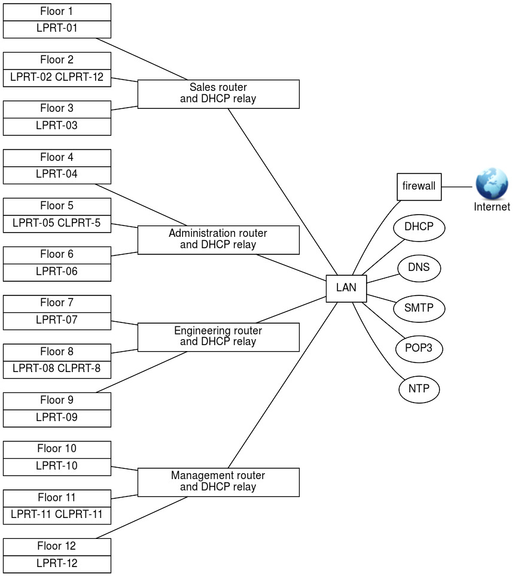

##  DHCP Configuration (210.1)

Candidates should be able to configure a DHCP server. This objective
includes setting default and per client options, adding static hosts and
BOOTP hosts. Also included is configuring a DHCP relay agent and
maintaining the DHCP server.

###   Key Knowledge Areas

- DHCP configuration files, terms and utilities

- Subnet and dynamically-allocated range setup

###  Terms and Utilities

-   `dhcpd.conf`

-   `dhcpd.leases`

-   `/var/log/daemon.log` and `/var/log/messages`

-   `arp`

-   `dhcpd`

-   `radvd`

-   `radvd.conf`

##  What is DHCP?

The "Dynamic Host Configuration Protocol" (DHCP) is a protocol that
allows computers to get configuration information about the network from
the network. DHCP addresses are "leased" from servers to clients for a
period of time. There is a separate protocol for assigning IPv6
addresses called DHCPv6, although the "Neighbour Discovery Protocol"
(NDP) better fits this purpose.

The process of requesting and assigning addresses works as follows:

-   When a computer starts, it sends a request to the network.

-   Any DHCP servers that receive this request decide what address and
    other configuration options to assign to the client. This is
    typically based on things like: which network the request arrived
    on, or the MAC address of the  interface that sent the request.

-   Each server sends a packet which offers to assign the address to the
    client.

-   The client decides which offer to accept, and sends a message to the
    server confirming the choice.

-   The server acknowledges that it has recorded this address.

Amongst the most commonly used configuration items are: `ip-address`,
`host-name`, `domain-name`, `subnet-mask`, `broadcast-address`,
`routers` and `domain-name-servers`.

The information is requested by a DHCP client and provided by a DHCP
DHCPServer DHCPClient server. By default, the server listens for
requests on udp port 67 and 67 answers through udp port 68, but it can
be told to listen to another 68 port instead with the `-p` option. The
DHCP server will then answer through an udp port with a number one
higher than the port it listens to.

Hosts using IPv6 are actually capable of assigning themselves link-local
IP addresses using stateless autoconfiguration. DHCPv6 or NDP may be
used to assign additional globally unique addresses and other
configuration parameters. NDP is described in further detail in the
section on `radvd`

The web-site [Resources for DHCP](https://www.isc.org/downloads/dhcp/)
contains a lot of (pointers to) information on the DHCP protocol,
including RFC's.

###   How is the server configured?

dhcpd The configuration of the DHCP server, `dhcpd`, is done
DHCPdhcpd.conf by means of its configuration file `/etc/dhcpd.conf`.

The elements that can be used in a configuration file are: (global)
parameters, shared networks, subnets, groups and hosts.

####  What are (global) parameters?

Parameters can be seen as variables that get assigned a value and are
DHCPGlobal Parameters passed from the server to the client. Some
parameters start with the *option* keyword and some do not. Parameters
that do not start with the *option* keyword are either parameters that
control the behaviour of the DHCP server or are parameters that are
optional in the DHCP protocol.

The difference between "normal" parameters and "global" parameters lies
purely in the scope of the parameters. DHCPNormal Parameters If, for
instance, the DNS is always the same, it is pointless to add a
`domain-name-servers` parameter-definition statement to every
network-definition statement. By assigning the `domain-name-servers`
parameter a value at the beginning of the configuration file, the
parameter becomes a global parameter and its value becomes the default
value for that parameter.

The value of a global parameter can be overridden by assigning it
another value in subsequent sections.

####  What is a shared-network declaration?

A shared-network declaration is used if there are multiple subnets
DHCPshared network on the same physical network. Parameters that are the
same for all the subnets belonging to the shared-network can be defined
once above the subnet-declarations within the shared-network declaration
that encompasses those subnet-declarations.

####  What is a subnet declaration?

A subnet-declaration is used to define a network segment. Parameters
DHCPsubnet declaration that only apply to the subnet in question are
defined within the subnet-declaration.

A subnet-declaration must contain a range statement that defines the
IP-addresses the DHCP-server can give to clients on that subnet.

####  What is a group declaration?

A group-declaration is used to group other declarations, including
DHCPgroup declaration group-declarations, that have a number of
properties in common so that the common properties only have to be be
specified once in stead of for every declaration.

####  What is a host declaration?

A host declaration is used to set properties for a specific client.
DHCPhost declaration The client identifies itself to the DHCP server by
one of its unique properties such as its NIC address or its
client-identifier. NIC address

###   Example

Consider a firm which has four departments: Sales, Administration,
Engineering and Management. All departments are located in the same
building and each department has three floors to its disposal.

On each floor, there are up to 200 workstations and one laser printer
(LPRT-xx). Furthermore each department has its own colour laser-printer
(CLPRT-xx) located on the middle floor. The printers can only be used by
users of the department the printers belong to.

All users obtain an IP-address from the company's DHCP-server and must
be able to reach the company's DNS-server and
NTP-server. All users get their mail using the POP3 protocol, send their
mail using the SMTP protocol and read their news using the NNTP
protocol.

A graphical representation of the company's network is shown below:

####  The network architecture

Assuming that the IP range 21.31.x.x has been assigned to the company
and that each department has its own network (determined by the highest
four bits of the third octet; in other words: the netmask used is /20 or
255.255.240.0), the subnets could be set up as follows:
Table 10.1. The first two octets are 21.31

|Dept.|Floor|IP range|Router|Description|
|----|----|----|----|----|
|0001|0001|21.31.17.0 - 21.31.17.255| |Sales floor #1|
|0001|0010|21.31.18.0 - 21.31.18.255|21.31.17.1|Sales floor #2|
|0001|0011|21.31.19.0 - 21.31.19.255| |Sales floor #3|
|0010|0100|21.31.36.0 - 21.31.36.255| |Administration #4|
|0010|0101|21.31.37.0 - 21.31.37.255|21.31.36.1|Administration #5|
|0010|0110|21.31.38.0 - 21.31.38.255| |Administration #6|
|0011|0111|21.31.55.0 - 21.31.55.255| |Engineering floor #7|
|0011|1000|21.31.56.0 - 21.31.56.255|21.31.55.1|Engineering floor #8|
|0011|1001|21.31.57.0 - 21.31.57.255| |Engineering floor #9|
|0100|1010|21.31.74.0 - 21.31.74.255| |Management floor #10|
|0100|1011|21.31.75.0 - 21.31.75.255|21.31.74.1|Management floor #11|
|0100|1100|21.31.76.0 - 21.31.76.255| |Management floor #12|

###   The network services available to workstations

The workstations on the company's network obtain their IP-address and
the IP-addresses of the available network services from the company's
DHCP-server via the department's DHCP-relay which also functions as a
router.

####  Subnet-independent Services

Subnet-independent services are the services that are available to all
workstations on the company's network regardless the subnet they are
on. The table below shows those services and their fixed IP-addresses.

|Service|   Description |IP-address|  Host name|
|----|----|----|----|
|  DHCP|         DHCP-server|  21.31.0.1    |  dhcp.company.com|
|  DNS  |       DNS         |  21.31.0.2    |  dns.company.com|
|  SMTP  |      SMTP-server |  21.31.0.3     | smtp.company.com|
|  POP3  |      POP3-server  | 21.31.0.4     | pop3.company.com|
 | NEWS   |     NNTP-server   |21.31.0.5     | news.company.com|
|NTP  |       NTP-server    |21.31.0.6     | ntp.company.com|

####  Subnet dependent services

Subnet-dependent services are the services that are only available to
the workstations on the same subnet as the service. The table below
shows those services and their fixed IP-addresses.

|Department|Service|Description|IP-address|Name|
|----|----|----|----|----|
|Router|Sales Router floor #2|21.31.17.1|rtr-02.company.com|
|Printer|Laser Printer floor #1|21.31.17.2|lprt-01.company.com|
|Sales|Printer|Laser Printer floor #2|21.31.18.2|lprt-02.company.com|
|Printer|Laser Printer floor #3|21.31.19.2|lprt-03.company.com|
|Printer|Color Laser Printer floor #2|21.31.18.3|clprt-02.company.com|
|Router|Administration Router floor #5|21.31.36.1|rtr-05.company.com|
|Printer|Laser Printer floor #4|21.31.36.2|lprt-04.company.com|
|Administration|Printer|Laser Printer floor #5|21.31.37.2|lprt-05.company.com|
|Printer|Laser Printer floor #6|21.31.38.2|lprt-06.company.com|
|Printer|Color Laser Printer floor #5|21.31.37.3|clprt-05.company.com|
|Router|Engineering Router floor #8|21.31.55.1|rtr-08.company.com|
|Printer|Laser Printer floor #7|21.31.55.2|lprt-07.company.com|
|Engineering|Printer|Laser Printer floor #8|21.31.56.2|lprt-08.company.com|
|Printer|Laser Printer floor #9|21.31.57.2|lprt-09.company.com|
|Printer|Color Laser Printer floor #8|21.31.56.3|clprt-08.company.com|
|Router|Management Router floor #11|21.31.74.1|rtr-11.company.com|
|Printer|Laser Printer floor #10|21.31.74.2|lprt-10.company.com|
|Management|Printer|Laser Printer floor #11|21.31.75.2|lprt-11.company.com|
|Printer|Laser Printer floor #12|21.31.76.2|lprt-12.company.com|
|Printer|Color Laser Printer floor #11|21.31.75.3|clprt-11.company.com|

###   Building the DHCP-server's configuration file

The information needed to be able to build a configuration file has
already been gathered in the previous sections when the network topology
was devised.

In this section the actual configuration file `/etc/dhcpd.conf` will be
filled with the necessary information.

####  The global parameters for services

Global parameters are put at the top of the configuration file:
DHCPoption DHCPdomain-name-servers DHCPsmtp-server DHCPpop-server
DHCPnntp-server

        # DNS
        option domain-name-servers 21.31.0.2;
        # SMTP
        option smtp-server 21.31.0.3;
        # POP3
        option pop-server 21.31.0.4;
        # NEWS
        option nntp-server 21.31.0.5;
        # NTP
        option time-servers 21.31.0.6;
                        

Another way to do this is by using domain names. A *single* domain name
*must* resolve to a *single* IP-address. Using domain names, you would
put the following entries in the configuration file:

        # DNS
        option domain-name-servers dns.company.com;
        # SMTP
        option smtp-server smtp.company.com;
        # POP3
        option pop-server pop3.company.com;
        # NEWS
        option nntp-server news.company.com;
        # NTP
        option time-servers ntp.company.com;
                        

####  The company's shared-networks and subnets

As has been discussed in the previous sections, there are four different
networks, one for each department and there are twelve different
IP-address ranges, one for each floor. Furthermore, each network has its
own router and printers.

This translates into four shared-networks each having their own netmask
and broadcast-address and encompassing three IP-address ranges.

The netmask is an IP-address used to determine the network a
workstation, or some other network device that uses an IP-address, is
on. A netmask has 1's in the bit-positions that are the same for all
network devices in that network and 0's in the other positions. Since
all the subnets on a department's shared-network are on the same
physical network, the distinction is made on the shared-network level,
not on the floor level. The floor level has been coded into the
IP-address (low-nibble of the third octet) to prepare for the planned
instalment next year of one router per floor in stead of one router per
department. The netmask is calculated as follows:

    21.31.16.0 - : | 0001 0101 | 0001 1111 | 0001 0000 | 0000 0000 | SALES
    21.31.31.255 : | 0001 0101 | 0001 1111 | 0001 1111 | 1111 1111 | NETWORK

    21.31.32.0 - : | 0001 0101 | 0001 1111 | 0010 0000 | 0000 0000 | ADMINISTRATION
    21.31.47.255 : | 0001 0101 | 0001 1111 | 0010 1111 | 1111 1111 | NETWORK 

    21.31.48.0 - : | 0001 0101 | 0001 1111 | 0011 0000 | 0000 0000 | ENGINEERING
    21.31.63.255 : | 0001 0101 | 0001 1111 | 0011 1111 | 1111 1111 | NETWORK

    21.31.64.0 - : | 0001 0101 | 0001 1111 | 0100 0000 | 0000 0000 | MANAGEMENT 
    21.31.79.255 : | 0001 0101 | 0001 1111 | 0100 1111 | 1111 1111 | NETWORK

    fixed-bits   : | 1111 1111 | 1111 1111 | 1111 0000 | 0000 0000 | NETMASK
                        255         255         240          0
                        

Using a netmask of 255.255.240.0, the network an IP-address is on can be
determined. This is done by AND-ing the IP-address with the netmask. To
determine on which of the four networks a workstation with IP-address
21.31.57.105 is, the following calculation is performed:

    21.31.57.105 : | 0001 0101 | 0001 1111 | 0011 1001 | 0110 1001 | IP-ADDRESS
    255.255.240.0: | 1111 1111 | 1111 1111 | 1111 0000 | 0000 0000 | AND NETMASK
    21.31.48.0:    | 0001 0101 | 0001 1111 | 0011 0000 | 0000 0000 | GIVES NETWORK
                        

The IP-address 21.31.57.105 is on the 21.31.48.0 network, which is the
Engineering-network.

The broadcast-address is used to send packets to every workstation
broadcast on a network. A broadcast-address differs per network and can
be determined by replacing all bits reserved/used for the host address
(as denoted by the subnet mask) with 1's.

Another way of determining the broadcast-address is to take the inverse
of the netmask, in this case 0.0.15.255, and then OR the result with the
network address:

    21.31.16.0 - : | 0001 0101 | 0001 1111 | 0001 0000 | 0000 0000 | SALES
    0.0.15.255   : | 0000 0000 | 0000 0000 | 0000 1111 | 1111 1111 | OR INV NETMASK
    21.31.31.255 : | 0001 0101 | 0001 1111 | 0001 1111 | 1111 1111 | GIVES BCAST

    21.31.32.0 - : | 0001 0101 | 0001 1111 | 0010 0000 | 0000 0000 | ADMINISTRATION
    0.0.15.255   : | 0000 0000 | 0000 0000 | 0000 1111 | 1111 1111 | OR INV NETMASK
    21.31.47.255 : | 0001 0101 | 0001 1111 | 0010 1111 | 1111 1111 | GIVES BCAST

    21.31.48.0 - : | 0001 0101 | 0001 1111 | 0011 0000 | 0000 0000 | ENGINEERING
    0.0.15.255   : | 0000 0000 | 0000 0000 | 0000 1111 | 1111 1111 | OR INV NETMASK
    21.31.63.255 : | 0001 0101 | 0001 1111 | 0011 1111 | 1111 1111 | GIVES BCAST

    21.31.64.0 - : | 0001 0101 | 0001 1111 | 0100 0000 | 0000 0000 | MANAGEMENT 
    0.0.15.255   : | 0000 0000 | 0000 0000 | 0000 1111 | 1111 1111 | OR INV NETMASK
    21.31.79.255 : | 0001 0101 | 0001 1111 | 0100 1111 | 1111 1111 | GIVES BCAST
                        

The broadcast-address for the network an IP-address is on can be
determined by OR-ing the IP-address with the inverse-netmask. For a
workstation with IP-address 21.31.57.105, the broadcast-address can be
calculated as follows:

    21.31.57.105 : | 0001 0101 | 0001 1111 | 0011 1001 | 0110 1001 | IP-ADDRESS
    0.0.15.255   : | 0000 0000 | 0000 0000 | 0000 1111 | 1111 1111 | OR INV NETMASK
    21.31.63.255 : | 0001 0101 | 0001 1111 | 0011 1111 | 1111 1111 | GIVES BCAST
                        

The IP-address 21.31.57.105 belongs to a network that has
broadcast-address 21.31.63.255, which is correct since the IP-address is
on the Engineering-network.

To tell the DHCP-server what IP-addresses to give-out per subnet, a
range statement must be added to the subnet. Is this example the
IP-addresses 21.31.x.0 to 21.31.x.10 and 21.31.x.211 to 21.31.x.255 on
every floor are reserved for printers and routers. This means that for
every subnet the range statement is:

    range 21.31.x.11 21.31.x.210
                        

Where "x" depends on the department and the floor.

To implement this structure, the following lines are added to the
configuration-file:

    # The Sales network, floors 1-3
    shared-network sales-net {
      # Sales-net specific parameters
      option routers 21.31.17.1;
      option lpr-servers 21.31.17.2, 21.31.18.2, 21.31.19.2, 21.31.18.3;
      option broadcast-address 21.31.31.255;
      subnet 21.31.17.0 netmask 255.255.240.0 {
        # Floor #1 specific parameters
        range 21.31.17.11 21.31.17.210;
      }
      subnet 21.31.18.0 netmask 255.255.240.0 {
        # Floor #2 specific parameters
        range 21.31.18.11 21.31.18.210;
      }
      subnet 21.31.19.0 netmask 255.255.240.0 {
        # Floor #3 specific parameters
        range 21.31.19.11 21.31.19.210;
      }
    }

    # The Administration network, floors 4-6
    shared-network administration-net {
      # Administration-net specific parameters
      option routers 21.31.36.1;
      option lpr-servers 21.31.36.2, 21.31.37.2, 21.31.38.2, 21.31.37.3;
      option broadcast-address 21.31.47.255;
      subnet 21.31.36.0 netmask 255.255.240.0 {
        # Floor #4 specific parameters
        range 21.31.36.11 21.31.36.210;
      }
      subnet 21.31.37.0 netmask 255.255.240.0 {
        # Floor #5 specific parameters
        range 21.31.37.11 21.31.37.210;
      }
      subnet 21.31.38.0 netmask 255.255.240.0 {
        # Floor #6 specific parameters
        range 21.31.38.11 21.31.38.210;
      }
    }

    # The Engineering network, floors 7-9
    shared-network engineering-net {
      # Engineering-net specific parameters
      option routers 21.31.55.1;
      option lpr-servers 21.31.55.2, 21.31.56.2, 21.31.57.2, 21.31.56.3;
      option broadcast-address 21.31.63.255;
      subnet 21.31.55.0 netmask 255.255.240.0 {
        # Floor #7 specific parameters
        range 21.31.55.11 21.31.55.210;
      }
      subnet 21.31.56.0 netmask 255.255.240.0 {
        # Floor #8 specific parameters
        range 21.31.56.11 21.31.56.210;
      }
      subnet 21.31.57.0 netmask 255.255.240.0 {
        # Floor #9 specific parameters
        range 21.31.57.11 21.31.57.210;
      }
    }

    # The Management network, floors 10-12
    shared-network management-net {
      # Management-net specific parameters
      option routers 21.31.74.1;
      option lpr-servers 21.31.74.2, 21.31.75.2, 21.31.76.2, 21.31.75.3;
      option broadcast-address 21.31.79.255;
      subnet 21.31.74.0 netmask 255.255.240.0 {
        # Floor #10 specific parameters
        range 21.31.74.11 21.31.74.210;
      }
      subnet 21.31.75.0 netmask 255.255.240.0 {
        # Floor #11 specific parameters
        range 21.31.75.11 21.31.75.210;
      }
      subnet 21.31.76.0 netmask 255.255.240.0 {
        # Floor #12 specific parameters
        range 21.31.76.11 21.31.76.210;
      }
    }
                        

###   Static hosts

A static host is a host that always gets the same IP-address from the
DHCP-server in opposite to dynamic hosts which get their DHCPStatic Host
IP-address from a range of IP-addresses.

Obviously, the DHCP-server must be able recognize the host to be able to
conclude that the host has been defined as a static one in the
DHCP-server's configuration file. This can be done by using the
`dhcp-client-identifier` option or by using the DHCPclient identifier
`hardware ethernet` option. DHCPethernet address

The `dhcp-client-identifier` is send to the server by the client (host)
and must uniquely identify that client. This is not safe because there
is no way to be sure that there isn't a second client that uses the
same identifier.

The `hardware ethernet` option causes the match to be done on the
client's NIC-address which is world-wide unique.

If the client does not send a `dhcp-client-identifier`, then the
NIC-address is used to identify the client.

There are two designers, working for the Engineering department, that
come to the office sometimes to get a hardcopy of their designs in
colour. These designers are called "luke" and "leah" and they bring
their laptops and connect them to the Engineering-network. The host
names of their machines will be "luke" and "leah".

To make this so, the administrator has added the following lines to the
DHCP-server's configuration file:

    group {
          # options that apply to all the static hosts
          option routers 21.31.55.1;
          option lpr-servers 21.31.56.3;
          option broadcast-address 21.31.63.255;
          netmask 255.255.240.0;
          host luke {
                  # specific for luke
                  hardware ethernet AA:88:54:72:7F:92;
                  fixed-address 21.31.55.211;
                  option host-name "luke";
          }

          host leah {
                  # specific for leah
                  hardware ethernet CC:88:54:72:84:4F;
                  fixed-address 21.31.55.212;
                  option host-name "leah";
          }
    }
                    

###   Static BOOTP hosts

This is a special static host. If luke and leah's laptops were
BOOTP-clients, the administrator could have added the following
DHCPBOOTP lines to the DHCP-server's configuration file:

    group {
          # options that apply to all the static hosts
          option routers 21.31.55.1;
          option lpr-servers 21.31.56.3;
          option broadcast-address 21.31.63.255;
          netmask 255.255.240.0;
          host luke {
                  # specific for luke
                  filename "lukes-boot-file";
                  server-name "server name to send to luke";
                  next-server <address of server to load boot-file from>;
                  hardware ethernet AA:88:54:72:7F:92;
                  fixed-address 21.31.55.211;
                  option host-name "luke";
          }

          host leah {
                  # specific for leah
                  filename "leahs-boot-file";
                  server-name "server name to send to leah";
                  next-server <address of server to load boot-file from>;
                  hardware ethernet CC:88:54:72:84:4F;
                  fixed-address 21.31.55.212;
                  option host-name "leah";
          }
    }
                    

The `filename` option states the name of the file to get from the server
defined in the `next-server` option. If the `next-server` is omitted,
the server to get the file from is the DHCP-server. The `server-name`
can be used to send the name of the server the client is booting from to
the client.

For information on the valid options, consult the dhcp-options man page
(`man dhcp-options`) and the dhcpd.conf man page (`man dhcpd.conf`).

Controlling the DHCP-server's behaviour

###   Leases

A lease is the amount of time a client may use the IP-address it got
from the DHCP-server. The client must refresh the lease periodically
because the IP-address can be given to another client if the lease is
expired. Normally, a client will be given the same IP-address if the
lease is refreshed before it expired.

The option `max-lease-time` is used to specify the DHCPmax-lease-time
maximum amount of time in seconds that will be assigned to a lease if
the client asks for a specific expiration time.

The option `default-lease-time` is used to specify the
DHCPdefault-lease-time amount of time in seconds that will be assigned
to a lease if a client does not ask for a specific expiration time.

The DHCP-server keeps a database of the leases it has issued in the file
`/var/dhcp/dhcpd.leases`. If this file is DHCPdhcpd.leases empty, this
is probably caused by the fact that you have only defined static hosts
in the DHCP-server's configuration file and you haven't used any
`range` statements. On the DHCP clients the leased IP addresses are kept
in the file `dhclient.leases`.

###   Interfaces the DHCP-server listens on

Unless you specify otherwise, `dhcpd` will listen on *all interfaces*
for a dhcp request. If you only want to serve requests on *eth0* for
instance, you can tell this to the daemon by including the parameter on
the command line that starts the daemon.

###   Reloading the DHCP-server after making changes

This is done as follows: DHCPreload

    # /etc/init.d/dhcp restart
                    

This will stop the running daemon, wait two seconds, then start a new
daemon which causes `/etc/dhcpd.conf` to be read again.

###   Logging

By default the DHCP server logs using syslogd, although many Linux
distributions have exchanged syslogd for Systemd's journald. Logging is
configured in the `dhcpd.conf` file using the log-facility keyword. This
statement causes the DHCP server to do all of its logging on the
specified log facility once the dhcpd.conf file has been read. By
default the DHCP server logs to the daemon facility. Possible log
facilities include auth, authpriv, cron, daemon, ftp, kern, lpr, mail,
mark, news, ntp, security, syslog, user, uucp, and local0 through
local7. Not all of these facilities are available on all systems, and
there may be other facilities available on other systems. In addition to
setting log-facility value, you may need to modify your syslog.conf file
to configure logging of the DHCP server. For example, you might add a
line like this:

        local7.debug /var/log/dhcpd.log
                    

The syntax of the syslog.conf file may be different on some operating
systems - consult the syslog.conf manual page to be sure. To get syslog
to start logging to the new file, you must first create the file with
correct ownership and permissions (usually, the same owner and
permissions of your /var/log/messages or /usr/adm/messages file should
be fine) and send a SIGHUP to syslogd. Note that `journald` does not log
to a plaintext file; it uses a binairy format instead. To view messages
specific for `dhcpd`, you have to filter these out using the
`journalctl` command.

DHCP-relaying

###   What is DHCP-relaying?

In our earlier example there is one DHCP-server for the whole
DHCPrelaying network and there are routers between the clients and that
server.

If a client would be able to connect to the DHCP-server through a
router, the DHCP-server would not see the NIC-address of the client but
the NIC-address of the router. This would mean that a static host for
instance, could not be recognized by its hardware address.

A DHCP-relay agent, such as `dhcrelay` provides a dhcrelay means for
relaying DHCP and BOOTP requests from one of the subnets to the
company's DHCP-server.

If you need more information, consult [The Internet Consortium DHCP
Homepage](http://www.isc.org/downloads/dhcp/).

The DHCP Relay Agent listens for DHCP and BOOTP queries and responses.
When a query is received from a client, dhcrelay forwards it to the list
of DHCP servers specified on the command line. When a reply is received
from a server, it is broadcast or unicast (according to the relay
agent's ability or the client's request) on the network from which the
original request came. If no interface names are specified on the
command line dhcrelay will identify all network interfaces,
elimininating non-broadcast interfaces if possible, and attempt to
configure each interface.

Please consult the man page (`man dhcrelay`) for further details.

Assigning addresses in IPv6 networks

radvd The previous paragraphs were mainly concerned with automatic IP
assignment in IPv4 networks. Networks using IPv6 often use the "Neighbor
Discovery Protocol" to obtain an IP address that is valid for the
network. In Linux, this protocol is handled by the "Router
Advertisement" (`radvd`) daemon.

The process for IPv6 address assignment works a bit different from IPv4
networks, because IPv6 hosts always assign link-local addresses for
IPv6-enabled interfaces automatically, without any help from external
hosts. NDP builds upon this *stateless autoconfiguration* process by
distributing "prefixes" instead of addresses. Using the prefix (which is
basically the network part of an IP address) obtained through NDP, hosts
can assign valid IPv6 addresses to themselves. So in contrast with the
DHCP daemon on IPv4 networks, NDP has no concept of IP pools and leases.

Instead of requesting an address, clients send "router sollicitation"
requests to obtain a valid IPv6 prefix. The `radvd` daemon responds to
these requests with router advertisement messages. These messages
contain the routing prefix used on the link, the maximum transmission
unit (MTU), and the address of the responsible default router.

The `radvd` daemon is configured by `/etc/radvd.conf
                `, which has to contain at least the interface the
daemon should listen on and the prefix it has to serve. Additionally,
`radvd` can periodically re-advertise its prefixes to hosts on the same
network. If you wish, you can also configure the lifetime of the IPv6
addresses that hosts configure for themselves.

A typical `radvd.conf` would look similar to the following:

    interface eth0 { 
            AdvSendAdvert on;
            MinRtrAdvInterval 3; 
            MaxRtrAdvInterval 10;
            prefix 2001:0db8:0100:f101::/64 { 
                    AdvOnLink on; 
                    AdvAutonomous on; 
                    AdvRouterAddr on; 
            };
    };
                    
