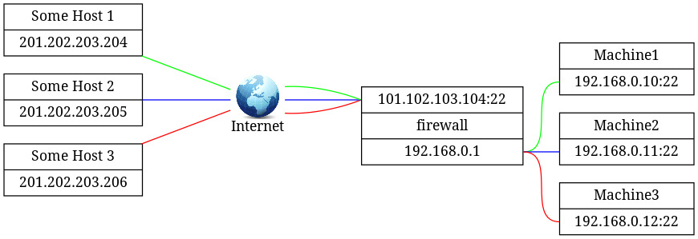

##  Configuring a router (212.1)

Candidates should be able to configure a system to perform network
address translation (NAT, IP masquerading) and state its significance in
protecting a network. This objective includes configuring port
redirection, managing filter rules and averting attacks.

###   Key Knowledge Areas

- Network Address Translation (NAT)

- iptables configuration files, tools and utilities

- Tools, commands and utilities to manage routing tables

- Private address ranges

- Port redirection and IP forwarding

- List and write filtering and rules that accept or block datagrams based
on source or destination protocol, port and address

- Save and reload filtering configurations

- Awareness of ip6tables and filtering

###   Terms and Utilities

-   `/proc/sys/net/ipv4`

-   `/etc/services`

-   `iptables`

##  Private Network Addresses

Why do Private Network Addresses exist? It has been common practice to
Private Network Addresses assign globally-unique addresses to all hosts
that use IP addresses. In order to extend the life of the IPv4 address
space, address registries are requiring more justification concerning
the need for extra address space than ever before, which makes it harder
for organizations to acquire additional address space.

Hosts within enterprises that use IP can be partitioned into three
categories:

- Category 1

 -   These hosts do not require access to the hosts of other IPCategory 1
    enterprises or on the Internet itself; hosts within this category
    may use IP addresses that are unambiguous within an enterprise, but
    may be ambiguous between enterprises.

- Category 2

    -   These are hosts that need access to a limited set of outside
    IPCategory 2 services (e.g., E-mail, FTP, netnews, remote login),
    which can be handled by mediating gateways (e.g., application layer
    gateways). For many hosts in this category, unrestricted external
    access (provided via IP connectivity) may be unnecessary and even
    undesirable (for privacy/security reasons). These hosts, the same as
    category 1 hosts, may use IP addresses that are unambiguous within
    an enterprise, but may be ambiguous between enterprises.

- Category 3

    -   These hosts need network-layer access outside the enterprise
    IPCategory 3 (provided via IP connectivity); hosts in the last
    category require IP addresses that are globally unambiguous.

We will refer to the hosts in the first and second categories as
"private" and to hosts in the third category as
"public".

Many applications require connectivity only within one enterprise and do
not need external (outside the enterprise) connectivity for the majority
of internal hosts. In larger enterprises it is often easy to identify a
substantial number of hosts using TCP/IP that do not need network-layer
connectivity outside the enterprise.

The Internet Assigned Numbers Authority (IANA) has reserved the 10/8
172.16/12 192.168/16 following three blocks of the IP address space for
private internets:

        10.0.0.0        -   10.255.255.255  (10/8 prefix)
        172.16.0.0      -   172.31.255.255  (172.16/12 prefix)
        192.168.0.0     -   192.168.255.255 (192.168/16 prefix)
                

We will refer to the first block as "24-bit block", the second as
"20-bit block", and to the third as "16-bit" block. Note that when no
subnetting is used (i.e. in pre- Classless Inter-Domain Routing (CIDR)
notation) the first block is nothing but a single class A network
number, while the second block is a set of 16 contiguous class B network
numbers and third block is a set of 256 contiguous class C network
numbers.

Even though IPv6 addresses are not likely to run out in the foreseeable
future, the need for allocating private addresses has been recognized.
RFC4193 describes address block fc00::/7, which is the approximate
counterpart of the IPv4 private addresses described above.

In addition to private IP addresses, IPv6 re-introduces the concept of
link-local addresses, valid only for communications within the network
segment (link) or the broadcast domain that the host is connected to.
Routers do not forward packets with link-local addresses, because they
are not guaranteed to be unique outside their network segment. In IPv4,
the network range 169.254.0.0/16 was reserved for interfaces to allocate
an IP address to themselves automatically. In practice, finding an IP
address in this range on an interface generally means that DHCP
allocation has failed, as link-local addressing is not generally used in
IPv4 networks.

In IPv6 networks, interfaces *always* allocate a link-local address in
addition to potentially other configured or allocated IPv6 addresses.
Therefore, IPv6 interfaces usually have more than one address.
Link-local address are an integral part of the IPv6 protocol standard to
facilitate neighbour discovery (NDP) and allocating globally unique IP
addresses using DHCP6. Interfaces configured for IPv6 use part of their
MAC address as a means to create a (hopefully) unique link-local address
in the fe80::/64 range.

###   Network Address Translation (NAT)


The figure above displays a hypothetical
situation which will serve as an example in the following explanation.

This section describes Network Address Translation (NAT), which is a
technique to rewrite the source or destination address (or sometimes
both) of certain IP traffic. It can be used to enable hosts using a
private IP address to communicate with hosts using a globally unique IP
address. NAT is primarily an IPv4 concept. IPv6 discourages the use of
NAT, because its creators believed it causes more problems than it
solves. Under certain circumstances beyond the scope of this book,
however, a need to rewrite IPv6 addresses may arise.

"The Firm" has four machines, 1 to 4, which are connected via a network
switch and have private IP addresses in the 192.168.x.x range. Machine 4
serves as a router to the Internet and has two network interfaces. One
connects the router to The Firm's internal network via the network
switch and has a private IP address of 192.168.0.1, while the other
connects the router to the Internet and has a valid (dynamic) IP address
of 101.102.103.104.

Let's say that the user at Machine 2 wishes to look at a web page on
Some Host (http://SomeHost.example) with an IP address of
201.202.203.204. To be able to see the web page, Machine 2 must be able
to get information from the Internet and thus must be, in some way,
connected to the Internet. And indeed, Machine 2 has an indirect
connection to the Internet via Machine 4, but how can this work? Machine
2 has a private IP address which is not supported (routed) on the
Internet!

This is where NAT kicks in. Machine 4, the router, replaces the private
IP address of Machine 2 (and also of Machine 1 and 3 if needed) with its
own IP address before sending the request to Some Host. Some Host thinks
that a machine with IP address 101.102.103.104 asked for the web page
and responds by sending the web page to Machine 4.

Machine 4 knows that it has replaced the IP address of Machine 2 with
its own before sending the request to Some Host so it also knows that
the answer it got to the request has to go to Machine 2. Machine 4
accomplishes this by replacing its own IP address in the answer by the
IP address of Machine 2.

This is in a nutshell how NAT works. For more detailed information
consult RFC1631


##  The Linux firewall, an overview

###   Implementation

The Linux firewall is implemented in
the kernel (as of version 2.3.15). The *NETFILTER* modules implement the
packet filtering rules. The user space application `iptables` is used to
configure these rules.

###   Netfilter "hooks"

As the figure above shows, netfilter supports five different hooks in
netfilterhooks the protocol stack. These hooks enable us to examine and
modify (if necessary) every packet passing through the kernel.


NF\_ACCEPT

-   Continue traversal as normal. iptablesNF\_ACCEPT

NF\_DROP

-   Drop the packet and do not continue traversal. iptablesNF\_DROP

NF\_QUEUE

-   Queue the packet for userspace handling. iptablesNF\_QUEUE

NF\_REPEAT

-   Call this hook again. iptablesNF\_REPEAT

NF\_STOLEN

-   Take over (absorb) the packet but do not continue traversal.
    iptablesNF\_STOLEN

###   Tables and Chains

By default five chains (the netfilter hooks) and three tables are
supported. As the figure below shows, certain chains are only valid for
certain tables.

| | |CHAIN| | | |
|----|----|----|----|----|----|----|
| | |PREROUTING|INPUT|FORWARD|OUTPUT|POSTROUTING|
|TABLE|MANGLE|V| | |V| |
| |NAT|V| | |V|V|
| |FILTER| |V|V|V| |

###   The *FILTER* table

IPTABLESFILTER The FILTER table is used for filtering packets. The
filter table contains three chains. The INPUT chain is used for all
packets that are intended for the firewall itself. The FORWARD chain is
used for all packets that come from outside the firewall and are
destined for another machine outside the firewall. These packets must
flow through the firewall. The OUTPUT chain is used for all packets
generated by the firewall.

###   The *NAT* table

IPTABLESNAT The NAT table is used for Network Address Translation. The
NAT table contains three chains. The PREROUTING chain is the first used
to alter incoming packets, before any routing decision has taken place.
The OUTPUT chain is used to alter packets generated by the firewall. The
POSTROUTING chain is the last chain where packets can be altered as they
leave the firewall. Note that traffic flowing through the firewall
passes the PREROUTING and POSTROUTING chains, whereas traffic originated
by the firewall passes the OUTPUT and POSTROUTING chains.

###   The *MANGLE* table

IPTABLESMANGLE The MANGLE table is used to mangle packets. We can change
several things but we can't do masquerading or network address
translation here. The mangle table contains two chains. The PREROUTING
chain is the first chain to alter incoming packets, before any routing
decision has taken place. The OUTPUT chain is used to alter packets
generated by the firewall.

###   Connection tracking: Stateful Firewalling

IPTABLESstateful Firewalls that are able to do connection tracking are
called Stateful Firewall *Stateful Firewalls*. These firewalls keep
track of established connections by memorizing the source and
destination addresses and port numbers (so-called 5-tuples) mostly in
order to determine valid return traffic. For protocols that do not use
port numbers (e.g. ICMP) other properties are maintained. When using a
stateful firewall, firewall rules have to be configured for traffic
going one way only, as valid return traffic is passed automatically by a
catch-all rule.

The `iptables` option used for connection tracking is iptables\--state
state the `--state` option.

state

-   This module, when combined with connection tracking, allows access
    to the connection tracking state for this packet.

\--state state

-   Where state is a comma-separated list of the connection states to
    match. Possible states are: NEW, ESTABLISHED, RELATED, and INVALID.

```{=html}
<!-- -->
```

`ip_conntrack`

-   The main connection-tracking code. iptablesip\_conntrack
    ip\_conntrack

`ip_conntrack_ftp`

-   Additional code needed to track ftp connections, both active and
    iptablesip\_conntrack\_ftp ip\_conntrack\_ftp passive.

The connection tracking modules have hooks into PREROUTING, FORWARD,
OUTPUT and POSTROUTING.

###   Hooks, Tables and Chains put together

Putting what we've discussed so far into one picture:


###   Adding extra functionality

ACCEPT

-   Let the packet through. iptablesACCEPT

DROP

-   Absorb the packet and forget about it. iptablesDROP

QUEUE

-   Pass the packet to user space. iptablesQUEUE

RETURN``

-   Stop traversing this chain and resume at the next rule in the
    previous calling chain. If the end of a built-in chain is reached or
    a rule in a built-in chain with target RETURN matches the packet,
    the target specified in the chain policy determines the fate of the
    packet. iptablesRETURN

Included in the standard distribution are a number of target extensions
for which support in the kernel must be enabled if you wish to use them.
Consult the man page of `iptables` for further details. Most of these
targets have options. The extension LOG for instance, has the following
five options: "\--log-level", "\--log-prefix", "\--log-tcp-sequence",
"\--log-tcp-options", "\--log-ip-options". Please consult the man page
for details on options per target.

LOG

-   Turn on kernel logging of matching packets. When this option
    iptablesLOG is set for a rule, the Linux kernel will print some
    information on all matching packets (such as most IP header fields)
    via printk().

MARK

-   This is used to set the netfilter mark value associated with
    iptablesMARK the packet. It is only valid in the mangle table.

REJECT

-   This is used to send back an error packet in response to the
    iptablesREJECT matched packet; otherwise, it is equivalent to DROP.
    This target is only valid in the INPUT, FORWARD and OUTPUT chains
    and user-defined chains which are only called by those chains.

TOS

-   This is used to set the 8-bit Type of Service field in the IP
    iptablesTOS header. It is only valid in the mangle table.

MIRROR

-   This is an experimental demonstration target which inverts
    iptablesMIRROR the source and destination fields in the IP header
    and retransmits the packet. It is only valid in the INPUT, FORWARD
    and OUTPUT chains and user-defined chains which are only called by
    those chains.

SNAT

-   This target is only valid in the POSTROUTING chain of the
    iptablesSNAT SNAT nat table. It specifies that the source address of
    the packet should be modified (and all future packets in this
    connection will also be mangled), and rules should cease being
    examined.

DNAT

-   This target is only valid in the PREROUTING, OUTPUT and iptablesDNAT
    DNAT user-defined chains (which are only called by those chains) of
    the nat table. It specifies that the destination address of the
    packet should be modified (and all future packets in this connection
    will also be mangled), and rules should cease being examined.

MASQUERADE

-   This target is only valid in the POSTROUTING chain of the
    iptablesMASQUERADE nat table. It should only be used with
    dynamically assigned IP (dialup) connections: if you have a static
    IP address, you should use the SNAT target. Masquerading is
    equivalent to specifying a mapping to the IP address of the
    interface the packet is going out, but also has the effect that
    connections are forgotten when the interface goes down. This is the
    correct behaviour when the next dialup is unlikely to have the same
    interface address (and hence any established connections are lost
    anyway).

REDIRECT

-   This target is only valid in the PREROUTING, OUTPUT and
    iptablesREDIRECT user-defined chains (which are only called by those
    chains) of the nat table. It alters the destination IP address to
    send the packet to the machine itself (locally-generated packets are
    mapped to the 127.0.0.1 address).

tcp

-   These extensions are loaded if "\--protocol tcp" is specified,
    iptablestcp and no other match is specified.

udp

-   These extensions are loaded if "\--protocol udp" is specified,
    iptablesudp and no other match is specified.

icmp

-   This extension is loaded if "\--protocol icmp" is specified, and
    iptablesicmp no other match is specified.

mac

-   Match source MAC address. It must be of the form iptablesmac
    XX:XX:XX:XX:XX:XX. Note that this only makes sense for packets
    entering the PREROUTING, FORWARD or INPUT chains for packets coming
    from an ethernet device.

limit

-   This module matches at a limited rate using a token bucket
    iptableslimit filter: it can be used in combination with the LOG
    target to give limited logging. A rule using this extension will
    match until this limit is reached (unless the "!" flag is used).

multiport

-   This module matches a set of source or destination ports. Up to
    iptablesmultiport 15 ports can be specified. It can only be used in
    conjunction with -p tcp or -p udp.

mark

-   This module matches the netfilter mark field associated with a
    iptablesmark packet (which can be set using the MARK target).

owner

-   This module attempts to match various characteristics of the
    iptablesowner packet creator for locally-generated packets. It is
    only valid in the OUTPUT chain, and even then some packets (such as
    ICMP responses) may have no owner and hence, never match.

state

-   This module, when combined with connection tracking, allows
    iptablesstate state access to the connection tracking state for this
    packet.

unclean

-   This module takes no options, but attempts to match packets
    iptablesunclean which seem malformed or unusual. This is regarded as
    experimental.

tos

-   This module matches the 8 bits of Type of Service field in the
    iptablestos IP header (ie. including the precedence bits).

###   `iptables` options

-t, \--table *table*

-   Table to manipulate (default: "filter"). The tables are as follows:

    filter

    :   This is the default table (if no -t option is passed). It
        contains the built-in chains INPUT (for packets destined to
        local sockets), FORWARD (for packets being routed through the
        box), and OUTPUT (for locally-generated packets).

    nat

    :   This table is consulted when a packet that creates a new
        connection is encountered. It consists of three built-ins:
        PREROUTING (for altering packets as soon as they come in),
        OUTPUT (for altering locally-generated packets before routing),
        and POSTROUTING (for altering packets as they are about to go
        out).

    mangle

    :   This table is used for specialized packet alteration. Until
        kernel 2.4.17 it had two built-in chains: PREROUTING (for
        altering incoming packets before routing) and OUTPUT (for
        altering locally-generated packets before routing). Since kernel
        2.4.18, three other built-in chains are also supported: INPUT
        (for packets coming into the box itself), FORWARD (for altering
        packets being routed through the box), and POSTROUTING (for
        altering packets as they are about to go out).

    raw

    :   This table is used mainly for configuring exemptions from
        connection tracking in combination with the NOTRACK target. It
        registers at the netfilter hooks with higher priority and is
        thus called before ip\_conntrack, or any other IP tables. It
        provides the following built-in chains: PREROUTING (for packets
        arriving via any network interface) OUTPUT (for packets
        generated by local processes).

-A, \--append *chain* *rule-specification*

-   Append one or more rules to the end of the selected chain.

-D, \--delete *chain* *rule-specification*; -D, \--delete *chain* *rulenum*

-   Delete one or more rules from the selected chain. You can use a
    rule-specification or a rule number.

-I, \--insert *chain* \[*rulenum*\] *rule-specification*

-   Insert one or more rules in the selected chain as the given rule
    number.

-R, \--replace *chain* *rulenum* *rule-specification*

-   Replace a rule in the selected chain.

-L, \--list \[*chain*\]

-   List all rules in the selected chain. This option is often used with
    the `-n` option for numeric output instead of displaying the output
    with the host names, network names and service names. This option
    also shows the default policy of each chain.

-F, \--flush \[*chain*\]

-   Flush the selected chain (all the chains in the table if none is
    given).

-P, \--policy *chain* *target*

-   Set the policy for packets not matched by any rule in the chain to
    the given target. This target can be a user-defined chain or one of
    the special values ACCEPT, DROP or REJECT.

-v, \--verbose

-   Verbose output.

\--line-numbers

-   When listing rules, add line numbers to the beginning of each rule,
    corresponding to the rule's position in the chain.

-N, \--new-chain *chain*

-   Create a new *user-defined* chain by the given name. There must be
    no target of that name already.

-X, \--delete-chain *chain*

-   Delete the optional *user-defined* chain specified. There must be no
    references to the chain. If there are, you must delete or replace
    the referring rules befor the chain can be deleted. If no argument
    is given, it will attempt to delete every non-builtin chain in the
    table!

Every chain has a default policy. This can only be changed when the
chain is empty. You can see the default policy using the `-L` option.
Then flush the chain of all its rules using the `-F table` option. Then
set the default policy using the `-P` option.

        iptables -t filter -L
        iptables -t filter -F INPUT
        iptables -t filter -P INPUT DROP
                    

REJECT is not possible as a default policy. If you still want REJECT as
an (implied) last rule then add a REJECT rule yourself as the last rule
in the chain.

###   `iptables` parameters

The following parameters make up a rule specification (as used in the
add, delete, insert, replace and append commands).

\[!\] -p, \--protocol *protocol*

-   The protocol of the rule or of the packet to check. The specified
    protocol can be one of tcp, udp, udplite, icmp, esp, ah, sctp or the
    special keyword "all", or it can be a numeric value representing one
    of these protocols. A protocol name from `/etc/protocols` is also
    allowed. A "!" argument before the protocol inverts the test. The
    number zero is equivalent to all.

\[!\] -s, \--source *address* \[/*mask*\]\[,\...\]

-   Source specification. Address can be either a network name, a
    hostname, a network IP address (with /mask), or a plain IP address.
    Hostnames will be resolved once only, before the rule is submitted
    to the kernel. Please note that specifying any name to be resolved
    with a remote query such as DNS is a really bad idea. The mask can
    be either a network mask or a plain number, specifying the number of
    1's at the left side of the network mask. Thus, a mask of 24 is
    equivalent to 255.255.255.0. Multiple addresses can be specified,
    but this will expand to multiple rules (when adding with -A), or
    will cause multiple rules to be deleted (with -D).

\[!\] -d, \--destination *address* \[/*mask*\]\[,\...\]

-   Destination specification. See also the "source address" parameter
    above.

-j, \--jump *target*

-   This specifies the target of the rule; i.e., what to do if the
    packet matches it.

\[!\] -i, \--in-interface *name*

-   Name of an interface via which a packet was received.

\[!\] -o, \--out-interface *name*

-   Name of an interface via which a packet is going to be sent.

###   `iptables` match extensions

`iptables` can use extended packet matching modules. These are loaded in
two ways: implicitly, when `-p` or `--protocol` is specified, or with
the `-m` or `-match` options, followed by the matching module name.
Possible are: addrtype, ah, cluster, comment, connbytes, connlimit,
connmark, conntrack, dccp, dscp, ecn, esp, hashlimit, helper, icmp,
iprange, length, limit, mac, mark, multiport, owner, physdev, pkttype,
policy, quota, ratetest, realm, recent, sctp, set, socket, state,
statistic, string, tcp, tcpmss, time, tos, ttl, u32, udp and unclean. A
few of them are explained her:

-m state

-   This module, when combined with connection tracking, allows access
    to the connection tracking state of this packet.

    \[!\] \--state *state*

    :   Here state is a comma separated list of the connection states to
        match. Possible states are INVALID (meaning that the packet
        could not be identified for some reason), ESTABLISHED (meaning
        that the packet is associated with a connection which has seen
        packets in both directions), NEW (meaning that the packet has
        started a new connection, or otherwise associated with a
        connection which has not seen packets in both directions), and
        RELATED (meaning that the packet is starting a new connection,
        but is associated with an existing connection, such as an FTP
        data transfer, or an ICMP error).

-m time

-   This matches if the packet arrival time/date is within a given
    range. All options are optional, but are ANDed when specified. It
    provides the following options:

    -m time \--datestart *YYYY* \[-*MM* \[-*DD* \[T*hh* \[:*mm* \[:*ss*\]\]\]\]\]

    :   Only match during the given time, which must be in ISO 8601
        \"T\" notation. The possible time range is 1970-01-01T00:00:00
        to 2038-01-19T04:17:07.

    -m time \--datestop *YYYY* \[-*MM* \[-*DD* \[T*hh* \[:*mm* \[:*ss*\]\]\]\]\]

    :   Only match during the given time, which must be in ISO 8601
        \"T\" notation. The possible time range is 1970-01-01T00:00:00
        to 2038-01-19T04:17:07.

-p udp, \--protocol udp

-   These extensions can be used if "\--protocol udp" is specified. It
    provides the following options:

    \[!\] \--source-port,\--sport *port* \[:*port*\]

    :   Source port or port range specification.

    \[!\] \--destination-port,\--dport *port* \[:*port*\]

    :   Destination port or port range specification.

-p tcp, \--protocol tcp

-   These extensions are loaded if "\--protocol tcp" is specified. It
    provides among other things the following options:

    \--source-port, \--sport \[!\] port\[:port\]

    :   Source port or port range specification. This can either be a
        service name or a port number. An inclusive range can also be
        specified, using the format port:port. If the first port is
        omitted, \"0\" is assumed; if the last is omitted, "65535" is
        assumed. If the second port greater then the first they will be
        swapped. The flag \--sport is a convenient alias for this
        option.

    \--destination-port, \--dport \[!\] port\[:port\]

    :   Destination port or port range specification. The flag \--dport
        is a convenient alias for this option.

    \--tcp-flags \[!\] mask comp

    :   Match when the TCP flags are as specified. The first argument is
        the flags which we should examine, written as a comma-sepa rated
        list, and the second argument is a comma-separated list of flags
        which must be set. Flags are: SYN ACK FIN RST URG PSH ALL NONE.
        Hence the command iptables -A FORWARD -p tcp \--tcp-flags
        SYN,ACK,FIN,RST SYN will only match packets with the SYN flag
        set, and the ACK, FIN and RST flags unset.

    \[!\] \--syn

    :   Only match TCP packets with the SYN bit set and the ACK and RST
        bits cleared. Such packets are used to request TCP connection
        initiation; for example, blocking such packets coming in an
        interface will prevent incoming TCP connections, but outgoing
        TCP connections will be unaffected. It is equivalent to
        \--tcp-flags SYN,RST,ACK SYN. If the "!" flag precedes the
        "\--syn", the sense of the option is inverted.

###   The Firm's network with IPTABLES

The picture below shows The Firm's network and the possible
combinations of traffic initiation/destination. We will go through six
possible scenario's.


###   (1) Traffic initiated by the firewall and destined for the Internet

We are running a DNS on the Firewall that needs to be able to consult
other DNS servers on the Internet (which use the UDP protocol and listen
to port 53). We also want to be able to use `ssh` (which uses the TCP
protocol and port 22) to connect to other systems on the Internet. We
are participating in a distributed.net project RC564 (RC5 64 bit
cracking) and are running a proxy server on the Firewall (which uses the
TCP protocol and port 2064 to communicate with the keyserver). We want
to be able to `ping` hosts on the Internet (the `ping` command uses the
ICMP protocol and message type 8 (echo-request)). The Firewall
communicates with the Internet through interface eth1. Taking all this
into consideration, the `iptables` commands needed are:

        iptables -t filter -A OUTPUT -o eth1 -p udp  --destination-port dns        \
        -m state --state NEW -j ACCEPT  
        iptables -t filter -A OUTPUT -o eth1 -p tcp  --destination-port ssh        \
        -m state --state NEW -j ACCEPT
        iptables -t filter -A OUTPUT -o eth1 -p tcp  --destination-port 2064       \
        -m state --state NEW -j ACCEPT
        iptables -t filter -A OUTPUT -o eth1 -p icmp --icmp-type echo-request      \
        -m state --state NEW -j ACCEPT
                    

These four `iptables` commands tell the firewall to allow outgoing
connection-initialization packets for DNS, SSH, TCP/2064 and ping.

###   (2) Traffic initiated from the Internet and destined for the Firewall

We want to be able to use `ssh`, which uses the TCP protocol and port
22, to connect to our Firewall from other systems on the Internet. The
`iptables` command needed is:

        iptables -t filter -A INPUT  -i eth1 -p tcp --destination-port ssh         \
        -m state --state NEW -j ACCEPT
                    

This `iptables` command tells the firewall to allow incoming connection
initialization packets for SSH.

###   (3) Traffic initiated by the Firewall and destined for the internal network

We want to be able to use `ssh`, which uses the TCP protocol and port
22, to connect to one of our internal machines from our Firewall. The
`iptables` command needed is:

        iptables -t filter -A OUTPUT -o eth0 -p tcp --destination-port ssh         \
        -m state --state NEW -j ACCEPT
                    

This `iptables` command tells the Firewall to allow outgoing SSH
connection initialization packets destined for a machine on the internal
Network.

###   (4) Traffic initiated by the internal network and destined for the firewall

The machines on the internal network, using the DNS of the firewall,
must be able to connect to the firewall using SSH, are processing RC564
keys, must be able to talk to the proxy on the firewall using port 2064
and must be able to ping the firewall for system administrative
purposes. The `iptables` commands needed are:

        iptables -t filter -A INPUT  -i eth0 -p udp --destination-port dns         \
        -m state --state NEW -j ACCEPT
        iptables -t filter -A INPUT  -i eth0 -p tcp --destination-port ssh         \
        -m state --state NEW -j ACCEPT
        iptables -t filter -A INPUT  -i eth0 -p tcp --destination-port 2064        \
        -m state --state NEW -j ACCEPT
        iptables -t filter -A INPUT  -i eth0 -p icmp --icmp-type echo-request      \
        -m state --state NEW -j ACCEPT
                    

These four `iptables` commands tell the firewall to allow incoming
connection-initialization packets for DNS, SSH, RC564 cracking and ping.

###   (5) Traffic initiated by the internal network and destined for the Internet

Every connection from a machine on the internal network to a machine on
the Internet is allowed. The `iptables` command needed is:

        iptables -t filter -A FORWARD -i eth0 -o eth1 -m state --state NEW -j ACCEPT
        iptables -t nat -A POSTROUTING -o eth1 -j SNAT --to-source 101.102.103.104
                    

This `iptables` command tells the firewall to allow ALL outgoing
connection initialization packets.

###   (6) Traffic initiated by the Internet and destined for the internal network

This does not occur because our local network uses private IP addresses
that can't be used on the Internet. Our local machines aren't visible
from the Internet.

What we could do to make one of our machines available from the Internet
is to let people connect to a certain port on the firewall and use NAT
to redirect them to a port on one of the machines on the internal
network.

Suppose Machine 2 has a web-server (or some other program) running which
listens to port 2345 and people from the Internet must be able to
connect to that program. Since The Firm is using private IP addresses
for their internal network, Machine 2 is not visible on the Internet.
The solution here is to tell Machine 4 that all data from the Internet
that is aimed at port 80 should be routed to port 2345 on Machine 2. The
`iptables` commands needed are:

        iptables -t nat -A PREROUTING -i eth1 -p tcp --destination-port 80         \
        -j DNAT --to-destination 192.168.0.11:2345
        iptables -t filter -A FORWARD -i eth1 -p tcp --destination-port 2345       \
        -m state --state NEW -j ACCEPT
                    

The first line changes the destination address and port. Since this then
becomes traffic aimed at another machine, the traffic must pass the
FORWARD filter. The second line sees to it that this traffic will be
allowed.

###   (!) Traffic as a result of initiated traffic

So far, we've only specified that connection initiation traffic is
allowed, but that is not enough. We also must allow ESTABLISHED and
RELATED traffic.

Let's tell the firewall that all ESTABLISHED and RELATED traffic,
regardless of type, interface etc. is allowed. We must also allow the
initiation of traffic on the firewalls `lo` interface because otherwise
some services, such a caching DNS server, will not work. We need the
following `iptables` commands to realize this:

        iptables -t filter -A INPUT   -m state --state ESTABLISHED,RELATED -j ACCEPT
        iptables -t filter -A FORWARD -m state --state ESTABLISHED,RELATED -j ACCEPT
        iptables -t filter -A OUTPUT  -m state --state ESTABLISHED,RELATED -j ACCEPT
        iptables -t filter -A INPUT   -m state --state NEW -i lo           -j ACCEPT
                    

Remember that these last rules can't cause a security problem because
the packets allowed are a result of the fact that we've accepted the
initiation of the connection in the first place.

###   All `iptables` commands put together

Adding stuff to start with a clean sheet and telling the firewall to
masquerade packets from the internal network aimed at the Internet can
be accomplished with the following commands:

    ###############################################################################
    # FLUSH ALL RULES IN THE MANGLE, NAT AND FILTER TABLES
    ###############################################################################
    iptables -t mangle -F
    iptables -t nat    -F
    iptables -t filter -F

    ###############################################################################
    # DELETE ALL USER-DEFINED (NOT BUILT-IN) CHAINS IN THE TABLES
    ###############################################################################
    iptables -t mangle -X
    iptables -t nat    -X
    iptables -t filter -X

    ###############################################################################
    # SET ALL POLICIES FOR ALL BUILT-IN CHAINS TO DROP
    ###############################################################################
    iptables -P INPUT   DROP
    iptables -P FORWARD DROP
    iptables -P OUTPUT  DROP

    ###############################################################################
    # (1) TRAFFIC INITIATED BY THE FIREWALL AND DESTINED FOR THE INTERNET
    #     DNS, SSH, RC564, PING
    ###############################################################################
    # ALLOW INITIATION BY THE FIREWALL
    iptables -t filter -A OUTPUT -o eth1 -p udp  --destination-port dns        \
    -m state --state NEW -j ACCEPT
    iptables -t filter -A OUTPUT -o eth1 -p tcp  --destination-port ssh        \
    -m state --state NEW -j ACCEPT
    iptables -t filter -A OUTPUT -o eth1 -p tcp  --destination-port 2064       \
    -m state --state NEW -j ACCEPT
    iptables -t filter -A OUTPUT -o eth1 -p icmp --icmp-type echo-request      \
    -m state --state NEW -j ACCEPT
    # ALLOW INCOMING RESPONSES 
    iptables -t filter -A INPUT  -i eth1                                       \
    -m state --state ESTABLISHED,RELATED -j ACCEPT

    ###############################################################################
    # (2) TRAFFIC INITIATED FROM THE INTERNET AND DESTINED FOR THE FIREWALL
    #     SSH
    ###############################################################################
    # ALLOW INITIATION
    iptables -t filter -A INPUT  -i eth1 -p tcp  --destination-port ssh        \
    -m state --state NEW -j ACCEPT
    # ALLOW RESPONSE
    iptables -t filter -A OUTPUT -o eth1 -p tcp  --destination-port ssh                     \
    -m state --state ESTABLISHED,RELATED -j ACCEPT

    ###############################################################################
    # (3) TRAFFIC INITIATED BY THE FIREWALL AND DESTINED FOR THE INTERNAL NETWORK
    #     SSH
    ###############################################################################
    # ALLOW INITIATION
    iptables -t filter -A OUTPUT -o eth0 -p tcp  --destination-port ssh        \
    -m state --state NEW -j ACCEPT
    # ALLOW RESPONSE
    iptables -t filter -A INPUT  -i eth0 -p tcp  --destination-port ssh        \
    -m state --state ESTABLISHED,RELATED -j ACCEPT

    ###############################################################################
    # (4) TRAFFIC INITIATED BY THE INTERNAL NETWORK AND DESTINED FOR THE FIREWALL
    #     DNS, SSH, RC564, PING
    ###############################################################################
    # ALLOW INITIATION
    iptables -t filter -A INPUT  -i eth0 -p udp  --destination-port dns        \
    -m state --state NEW -j ACCEPT
    iptables -t filter -A INPUT  -i eth0 -p tcp  --destination-port ssh        \
    -m state --state NEW -j ACCEPT
    iptables -t filter -A INPUT  -i eth0 -p tcp  --destination-port 2064       \
    -m state --state NEW -j ACCEPT
    iptables -t filter -A INPUT  -i eth0 -p icmp --icmp-type echo-request      \
    -m state --state NEW -j ACCEPT
    # ALLOW RESPONSE 
    iptables -t filter -A OUTPUT -o eth0                                       \
    -m state --state ESTABLISHED,RELATED -j ACCEPT

    ###############################################################################
    # (5) TRAFFIC INITIATED BY THE INTERNAL NETWORK AND DESTINED FOR THE OUTSIDE
    #     EVERYTHING WE CAN INITIATE IS ALLOWED
    ###############################################################################
    # ALLOW INITIATION OF EVERYTHING
    iptables -t filter -A FORWARD -i eth0 -o eth1                              \
    -m state --state NEW -j ACCEPT
    # ALLOW RECEPTION
    iptables -t filter -A FORWARD -i eth1 -o eth0                              \
    -m state --state ESTABLISHED,RELATED -j ACCEPT

    ###############################################################################
    # (6) TRAFFIC INITIATED FROM THE INTERNET AND DESTINED FOR THE INTERNAL NETWORK
    #     ALL FORBIDDEN, EXCEPT WEBSERVER FORWARDING TO INTERNAL MACHINE
    ###############################################################################
    # ALLOW DESTINATION NAT FROM FIREWALL:80 TO INTERNAL MACHINE:2345
    iptables -t nat -A PREROUTING -i eth1 -p tcp --destination-port 80         \
    -j DNAT --to-destination 192.168.0.11:2345
    iptables -t filter -A FORWARD -i eth1 -p tcp --destination-port 2345       \
    -m state --state NEW -j ACCEPT

    ###############################################################################
    # (!) TRAFFIC AS A RESULT OF INITIATED TRAFFIC
    #     ALL ALLOWED
    ###############################################################################
    # ALLOW ALL PACKETS RESULTING FROM ALLOWED CONNECTIONS
    iptables -t filter -A INPUT   -m state --state ESTABLISHED,RELATED -j ACCEPT
    iptables -t filter -A FORWARD -m state --state ESTABLISHED,RELATED -j ACCEPT
    iptables -t filter -A OUTPUT  -m state --state ESTABLISHED,RELATED -j ACCEPT
    iptables -t filter -A INPUT   -m state --state NEW -i lo           -j ACCEPT

    ###############################################################################
    # MASQUERADE PACKAGES FROM OUR INTERNAL NETWORK DESTINED FOR THE INTERNET
    # THIS IS SNAT (SOURCE NAT)
    ###############################################################################
    iptables -t nat    -A POSTROUTING -o eth1 -j SNAT --to-source 101.102.103.104

    ###############################################################################
    # ENABLE FORWARDING
    ###############################################################################
    echo 1 > /proc/sys/net/ipv4/ip_forward
                    

####  Saving And Restoring Firewall Rules

Firewall rules can be saved and restored easily by using the commands
`iptables-save` (which writes to iptablessave iptablesrestore
iptables-save iptables-restore `stdout`) and `iptables-restore` (which
reads from `stdin`). Assuming that we use the file `fwrules.saved` to
save and/or restore the rules, the two commands are:

        iptables-save > fwrules.saved
        iptables-restore < fwrules.saved
                

These commands can be used to initialize a firewall/routing machine at
boottime by putting them into a SysV startup script.

###   Port and/or IP forwarding

In the fifth example of this chapter the
client thinks it's connecting directly to the external server. The
router in between transparently routes all traffic and performs SOURCE
NAT to masquerade the internal (private) addresses. Keyword in this
example is transparency. If you need NAT for outgoing traffic to the
internet you can use SNAT (specifying the WAN IP address) if you have a
static WAN IP address. The kernel's connection tracking keeps track of
all the connections when the interface is taken down and brought back
up. This is not the case when using MASQUERADE. Using MASQUERADE is a
better idea when you have a dynamic WAN IP address because you don't
have to specify the used IP address but can specify the used interface.
Whatever IP address is on that interface, it is applied to al the
outgoing packets.

Besides packet filtering, firewalls can also perform port and IP
forwarding. In the sixth example (with port forwarding) an outside
client will connect to a port on the firewall. To the client the
connection will terminate on the firewall, but the firewall knows to
what internal server connections on the receiving port should be
forwarded. The firwewall will apply DESTINATION NAT to the packets and
pass them on.

Forwarded traffic can also have SOURCE NAT applied but in most cases
this is undesired because this would seriously hamper auditing the
connections on the receiving server(s). There is no way of telling the
original source address in that case - all traffic seems to originate at
the firewall.

Situations in which port forwarding is used are (amongst others):

-   Transparency is unwanted (security or other considerations):

    -   Example: One specific service available through the firewall is
        running on multiple internal servers, for instance one for each
        customer of our organization. Based on the source address a
        decision can be made to which server the traffic has to be
        forwarded.

-   Transparency is impossible (private IP addresses aren't routed on
    the internet):

    -   Example 1: If an organisation has only one external public IP
        address, but several services that have to be accessible from
        the internet running on different servers, these services will
        need to be made available to the outside as seemingly
        originating from one single IP address.

    -   Example 2: One internal server is serving a single service but
        listening on different port numbers (for instance to seperate
        between customer). Clients will connect to the IANA assigned
        service port and based on source IP address the firewall will
        forward the traffic to the assigned destination port for that
        source address.

-   Scaling considerations:

    -   Example: If an organisation has only one external public IP
        address but several services that have to be accessible from the
        internet running on different servers these services will need
        to be made available to the outside as seemingly originating
        from one single IP address.

Most often port and/or IP forwarding is used to enable incoming
connections from the internet to servers with a private IP address.

Port forwarding examples:

####Exaample 1


####Example 2


##  Denial of Service (DoS) attacks

###   Description

DoS attackers abuse the fact that resources on the Internet are DoS
Attack limited and that services can be disrupted by taking away (one
of) AttacksDoS their resources: storage-capacity, bandwith or
processor-capacity. This is often achieved by "packet flooding".

Packet flooding can be done with TCP, ICMP and UDP. DoS AttacksPacket
Flooding Packet Flooding When using TCP mostly the SYN, ACK and RST
flags are used. DoS AttacksSYN AttacksSYN SYN Attack When using ICMP,
the message types echo request and echo reply are used. This is called
"ping-flooding". When using UDP, the chargen (character generator
protocol) and echo UDP services are used.

Also, two systems (A and B) can be played out against each other by a
third system (C). System C sends packets to system A but changes the
source IP address of the packages it sends to the IP address of system
B. System A then thinks the packets came from system B and starts
sending replies to system B. DoS AttacksIP address spoofing DoS with IP
address spoofing This method is called "DoS with IP address spoofing".

Check the site <http://www.cert.org/> for a complete history of DoS and
DDoS (Distributed DoS) attacks. And have a look at RFC2827 which
describes Network Ingress Filtering, a method to DoS AttacksNetwork
Ingress Filtering Network Ingress Filtering RFC2827 prevent IP address
spoofing. This doesn't prevent DoS attacks but makes it possible to
trace the real IP address of the offender.

###   Prevention

It is impossible to fully prevent DoS attacks without disconnecting from
the Internet. What can be done to minimize the effects of DoS and DDoS
attacks is to apply some packet filtering and rate limiting rules to the
firewall.

Using /proc/sys/net/ipv4 (sysctl) to prevent simple DOS attacks

DoS Attackssysctl sysctl The kernel documentation describes the
following sysctl options to prevent simple DoS attacks:

-   tcp\_max\_orphans - INTEGER:

    -   Maximal number of TCP sockets not attached to any user file
        handle, held by system. If this number is exceeded orphaned
        connections are reset immediately and a warning is printed.

-   tcp\_max\_tw\_buckets - INTEGER:

    -   Maximal number of timewait sockets held by system
        simultaneously. If this number is exceeded time-wait socket is
        immediately destroyed and a warning is printed.

-   rp\_filter - INTEGER:

    -   0 - No source validation.

    -   1 - Strict mode as defined in RFC3704 Strict Reverse Path: Each
        incoming packet is tested against the FIB and if the interface
        is not the best reverse path the packet check will fail. By
        default failed packets are discarded.

    -   2 - Loose mode as defined in RFC3704 Loose Reverse Path: Each
        incoming packet's source address is also tested against the FIB
        and if the source address is not reachable via any interface the
        packet check will fail.

##  Routed

In an environment that uses dynamic routing, the *routed* daemon may be
used. The routed daemon manages the routing tables in the kernel. The
routed daemon only implements the RIP (Routing Information Protocol)
protocol. When you wish to dynamically route other types of protocols
gated can be used instead. Gated is a vintage routing daemon which
supports RIPv2, RIPng, OSPF, OSPF6, BGP4+ and BGP4-.

The routed daemon finds interfaces to directly connected hosts and
networks that are configured into the system and marked as up. (Mark
networks as up using the ifconfig command.) If multiple interfaces are
present, the routed daemon assumes that the local host forwards packets
between networks. The routed daemon transmits a RIP request packet on
each interface, using a broadcast message when the interface supports
it.

The routed daemon then listens for RIP routing requests and response
packets from other hosts. When the routed daemon supplies RIP
information to other hosts, it sends RIP update packets every 30 seconds
(containing copies of its routing tables) to all directly connected
hosts and networks.

When the routed daemon receives a Routing Information Protocol (RIP)
request packet to supply RIP routing information, the routed daemon
generates a reply in the form of a response packet. The response packet
is based on the information maintained in the kernel routing tables and
contains a list of known routes. Each route is marked with a hop-count
metric, which is the number of gateway hops between the source network
and the destination network. The metric for each route is relative to
the sending host. A metric of 16 or greater is considered infinite or
beyond reach.

###   When to use routed

If there are multiple possible paths to a certain destination, and you
want an alternate route to that destination to be selected automatically
(in case the default route to that destination for some reason is
unusable) the `routed` program can do this for you automatically.

Tools, commands and utilities to manage routing tables

###   `route`

`route` manipulates the kernel's IP routing tables. Its primary use is
to set up static routes to specific hosts or networks via an interface
after is has been configured with the `ifconfig` command. (The newest
Linux distro's use `ip route` these days instead of `route`.)

SYNOPSIS (most important opions):

        route
        route [-v] add [-net|-host] target [netmask NM] [gw GW] [metric N] [[dev] If]
        route [-v] del [-net|-host] target [netmask NM] [gw GW] [metric N] [[dev] If]
                    

`route` itself, without any parameters, displays the routing table. The
`-ee` option will generate a very long line with all paramaters from the
routing table.

-v

-   Select verbose operation.

-net\|-host

-   The target is a network or a host.

netmask Nm

-   When adding a network route, the netmask to be used.

gw GW

-   Route packets via a gateway. The specified gateway must be reachable
    first.

metric N

-   Set the metric field in the routing table (used by routing daemons)
    to N.

dev If

-   Force the route to be associated with the specified device. If *dev
    If* is the last option on the command line, the word *dev* may be
    omitted, as it's the default. Otherwise the order of the route
    modifiers (metric, netmask, gw, dev) doesn't matter.

Examples:

        route add -net 192.168.10.0 netmask 255.255.255.0 dev eth0
        route add -net 192.168.20.0 netmask 255.255.255.0 gw 192.168.1.10
        route add default gw 192.168.1.1 eth1
                    

The output of the kernel routing table is organized in the following
columns:

Destination

-   The destination network or destination host.

Gateway

-   The gateway address or "\*" if none is set.

Genmask

-   The netmask for the destination net; "255.255.255.255" for a host
    destination and "0.0.0.0" for the *default* route.

Flags

-   Possible flags include: U - Route is up, H - Target is a host, G -
    Use gateway, R - Reinstate route for dynamic routing, D -
    Dynamically installed by daemon or redirect, M - Modified from
    routing daemon or redirect, C - Cache entry, ! - Reject route

Metric

-   The "distance" to the target (usually counted in hops).

Ref

-   Number of references to this route.

Iface

-   Interface to which packets for this route will be sent.

Example:

        Kernel IP routing table
        Destination     Gateway         Genmask         Flags Metric Ref    Use Iface
        192.168.20.0    *               255.255.255.0   U     0      0        0 eth0
        link-local      *               255.255.0.0     U     1002   0        0 eth0
        default         192.168.20.1    0.0.0.0         UG    0      0        0 eth0
                    

##  `netstat`

Print network connections, routing tables, interface statistics,
masquerade connections, and multicast memberships.

`netstat` has a lot of possible options but the most used is the
following:

        # netstat -rn
        Kernel IP routing table
        Destination     Gateway         Genmask         Flags   MSS Window  irtt Iface
        192.168.20.0    0.0.0.0         255.255.255.0   U         0 0          0 eth0
        169.254.0.0     0.0.0.0         255.255.0.0     U         0 0          0 eth0
        0.0.0.0         192.168.20.1    0.0.0.0         UG        0 0          0 eth0
                    

`netstat -rn` will show also the routing table. The `-r` option will
show the routing table where the `-n` will prevent resolving IP
addresses and networks to names. Please look at the man pages for more
interesting options.

##  ip6tables

Ip6tables is the ipv6 equivalent of iptables. The syntax is identical to
its ipv4 counterpart, except for the use of 128-bit addresses instead of
32-bit addresses.

The following example allows ICMPv6:

        ip6tables -A INPUT -p icmpv6 -j ACCEPT
        ip6tables -A OUTPUT -p icmpv6 -j ACCEPT
            

Iptables and ip6tables may be used simultanously. Refer to the
`iptables(8)` manpage for detailed information.
